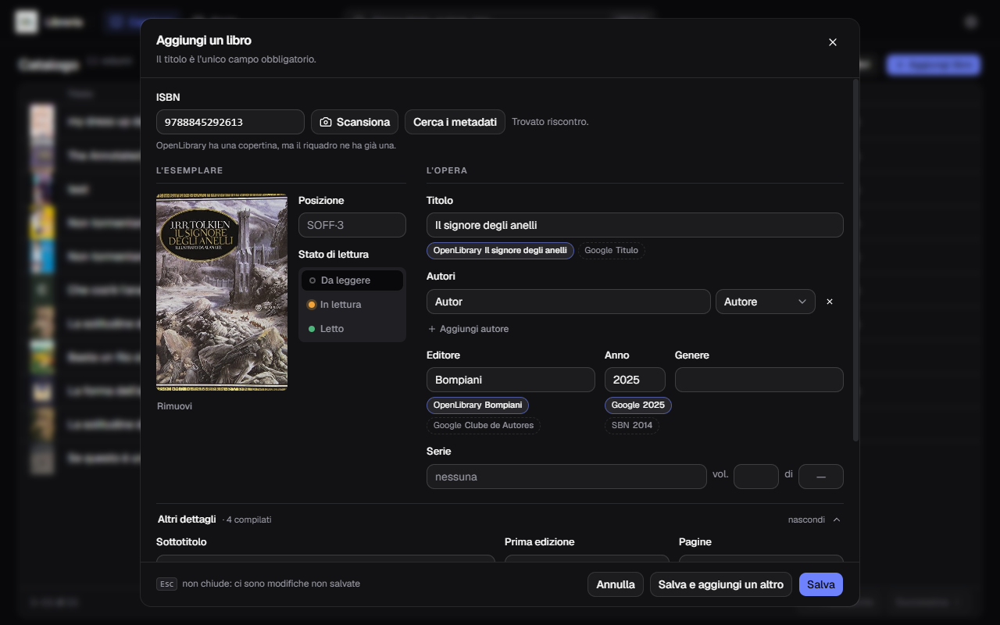
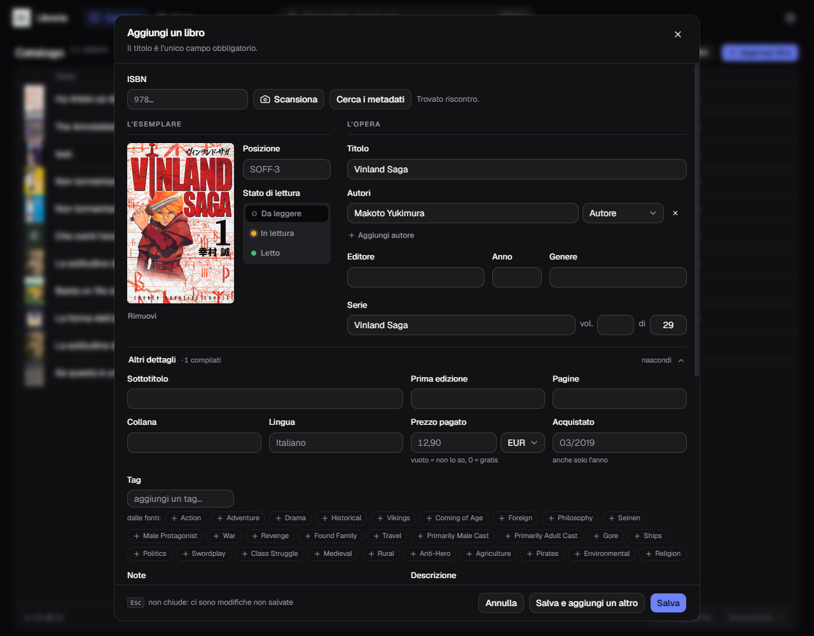
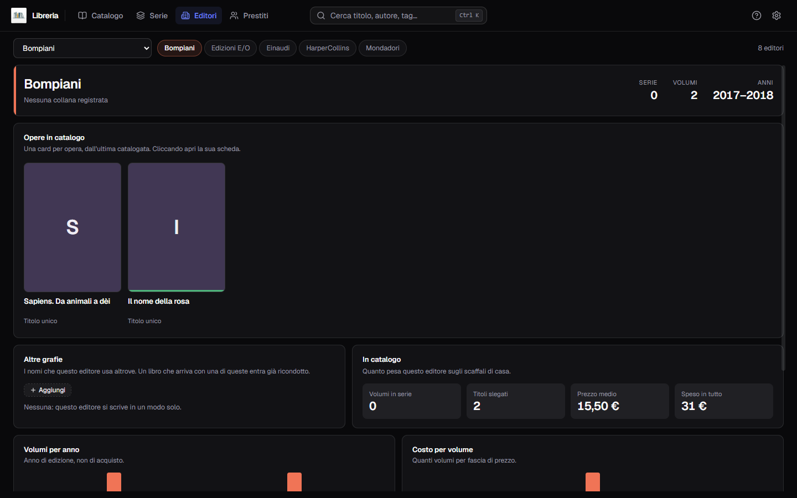

# Gestionale Libreria

**Il catalogo della tua libreria di carta.**
Inquadri il codice a barre, e il libro si cataloga da solo.

[**Guida d'uso**](wiki/it/Home.md) · [**User guide**](wiki/en/Home.md) · [Installazione](#installazione)

---

## Che cos'è

Un catalogo personale di libri **di carta**, per Windows e macOS. Sta su un
computer solo, non chiede un account e funziona **senza rete** — tranne quando
vai a cercare i dati di un libro, che arrivano da cinque cataloghi pubblici.

Non è una libreria digitale, non sincronizza niente, non ti manda notifiche:
tiene il conto di quello che hai sugli scaffali, di dove sta, di cosa manca a una
serie e di chi non ti ha ancora ridato quel volume.

Dal 1° settembre 2026 ogni release porta anche un **DMG universale per macOS**,
che il CI costruisce accanto all'installer di Windows: è stato aperto su un Mac e
funziona. Come si installa sta in [macOS](#macos).

<table>
<tr>
<td width="50%" valign="top">

### 📷 Cataloga con la webcam
Inquadri il codice a barre, l'ISBN si scrive da solo e parte la ricerca.
Con «Salva e aggiungi un altro» smaltisci una pila senza mai riaprire nulla.

</td>
<td width="50%" valign="top">

### 🔎 Cinque fonti, una scheda
OpenLibrary, Google Books, OPAC SBN e NiceBooks interrogate insieme; AniList per
il manga. Dove non sono d'accordo, scegli tu con un clic.

</td>
</tr>
<tr>
<td width="50%" valign="top">

### 📚 Le serie, coi buchi in vista
`mancano 2, 4–20`, e una fila di dorsi dove i volumi che non hai sono
tratteggiati. E una serie impara tag, genere, editore e collana dai suoi volumi,
per poi passarli al prossimo che aggiungi.

</td>
<td width="50%" valign="top">

### ⚡ Cerca e perdona i refusi
Ricerca full-text mentre digiti. Se scrivi `camileri`, ti mostra Camilleri —
e dieci filtri per genere, autore, editore, posizione, tag.

</td>
</tr>
<tr>
<td width="50%" valign="top">

### 🤝 Sai a chi l'hai prestato
Chi ha quale libro e da quanto, con la striscia di quello che non è sulla
mensola. Il libro che torna lo riconosci col codice a barre — e finché è fuori,
non si può eliminare per sbaglio.

</td>
<td width="50%" valign="top">

### 💾 Backup che non devi ricordarti
Uno all'avvio, uno al giorno, ultime sette copie. Con catalogo **e** copertine,
e un ripristino che nomina i due conteggi prima di sostituire.

</td>
</tr>
<tr>
<td width="50%" valign="top">

### 🌍 Due lingue, tema chiaro e scuro
Italiano e inglese, cambio istantaneo, errori compresi.
I tuoi dati restano scritti come li hai inseriti.

</td>
<td width="50%" valign="top">

### 🔔 Ti dice se esce una versione nuova
Un controllo all'avvio, il changelog nell'avviso e «Salta questa versione» se
non ti interessa. **Non scarica e non installa niente da sé**: apre la pagina
della release, il resto lo decidi tu.

</td>
</tr>
<tr>
<td width="50%" valign="top">

### 🔒 Nessun account, nessuna telemetria
Il catalogo sta su questo computer e non esce. Le uniche richieste in rete sono
quelle che chiedi tu: i dati di un libro, e l'elenco delle release.

</td>
</tr>
</table>

## Come si presenta

<table>
<tr>
<td width="50%"> <b>Una scheda riempita dalle fonti</b> — la copertina scende da sola, e sotto ogni campo conteso c'è la pastiglia con le alternative.</td>
<td width="50%"> <b>Le serie</b> — quanti volumi hai su quanti, quali mancano, e la fila dei dorsi.</td>
</tr>
<tr>
<td width="50%"> <b>I filtri</b> — dieci faccette con i conteggi, così sai in anticipo quanti libri resteranno.</td>
<td width="50%"> <b>Il manga da AniList</b> — autore e disegnatore distinti, il totale dei volumi, i tag proposti.</td>
</tr>
<tr>
<td width="50%"> <b>Gli editori</b> — un editore per volta: le sue opere in un carosello, le altre grafie con cui si presenta, e quattro grafici nella sua tinta.</td>
<td width="50%"> <b>Lo scanner</b> — mirino nel modulo, decodifica in WebAssembly, tendina per scegliere la fotocamera.</td>
</tr>
<tr>
<td width="50%"> <b>Le impostazioni</b> — il binario non elenca le sezioni, le riassume: sotto ogni voce c'è il valore di adesso.</td>
<td width="50%"> <b>Scorrere il catalogo</b> — dal modulo di un libro si passa al successivo senza chiudere, anche oltre il bordo della pagina.</td>
</tr>
</table>

## Da dove vengono i dati

| | Fonte | Che cosa porta | Chiave |
|:--:|---|---|:--:|
| 1 | **OpenLibrary** | comanda la cascata, e porta la copertina | — |
| 2 | **Google Books** | i dati dell'editoria che le altre non hanno | serve |
| 3 | **OPAC SBN** | il catalogo delle biblioteche italiane, riempie i buchi | — |
| 4 | **NiceBooks** | la copertura italiana, manga compresi, con la sua copertina | — |
| ★ | **AniList** | manga: autore e disegnatore distinti, serie, copertina | — |

Le prime quattro partono **insieme**, non in fila: comanda la prima che risponde,
le altre riempiono solo i campi lasciati vuoti. AniList sta fuori dalla cascata
perché non conosce gli ISBN — cataloga opere, non edizioni — quindi compare solo
nella ricerca per titolo, dove scegli tu.

## Installazione

### Windows

Serve `Gestionale Libreria_0.4.0_x64-setup.exe`, dalla [pagina dell'ultima
versione](https://github.com/alexkill536ita/gestionale-libreria/releases/latest).

Installa **per il solo utente corrente**, quindi non chiede l'amministratore, e
il componente WebView2 è già dentro: nessun download durante l'installazione.

> [!NOTE]
> Al primo avvio Windows mostra SmartScreen: **il programma non è firmato**, e un
> certificato costa un canone annuo senza nemmeno spegnere l'avviso da solo.
> **Ulteriori informazioni → Esegui comunque**.

I tuoi dati vivono in `%LOCALAPPDATA%\it.alexkill536ita.gestionale-libreria\` —
catalogo, copertine, backup, impostazioni — e **la disinstallazione non li
cancella**.

### macOS

`Gestionale Libreria_0.4.0_universal.dmg`, dalla [stessa
pagina](https://github.com/alexkill536ita/gestionale-libreria/releases/latest):
un file solo per Intel e Apple Silicon. È **firmato ad-hoc** — nessun
certificato Apple, nessuna notarizzazione — perché senza una firma Apple
Silicon rifiuta di eseguire un binario preso dalla rete.

Gatekeeper avvisa comunque, perché la notarizzazione non c'è: **Impostazioni di
sistema → Privacy e sicurezza → Apri comunque**, oppure
`xattr -dr com.apple.quarantine "/Applications/Gestionale Libreria.app"`.

Qui i dati stanno in
`~/Library/Application Support/it.alexkill536ita.gestionale-libreria/`.

## Documentazione

| | |
|---|---|
| 📘 [**Guida d'uso**](wiki/it/Home.md) | quindici pagine con le schermate: catalogo, metadati, copertine, serie, editori, prestiti, scanner, backup, aggiornamenti |
| 📗 [**User guide**](wiki/en/Home.md) | the same fifteen pages, in English |

## Partecipare

Il programma e questa documentazione sono MIT; **il codice sta in un repository a
parte**, e non per tenerlo nascosto: perché chi partecipa lo fa **dopo aver
chiesto**, non prima. Leggerlo, correggere un difetto, portarlo dove non arriva,
collaudarlo su un Mac — si dice cosa si ha in mente, e ci si accorda.

[**Chiedere di partecipare**](https://github.com/alexkill536ita/gestionale-libreria/issues/new?template=partecipare.yml)
· [*Ask in English*](https://github.com/alexkill536ita/gestionale-libreria/issues/new?template=take-part.yml)

Per un difetto quel modulo non serve: ce n'è uno suo —
[**segnalare un difetto**](https://github.com/alexkill536ita/gestionale-libreria/issues/new?template=difetto.yml)
· [*in English*](https://github.com/alexkill536ita/gestionale-libreria/issues/new?template=bug.yml)
— e per l'idea di una funzione basta una segnalazione libera. In nessuno dei due
casi c'entra il codice.

## Licenza

[MIT](LICENSE) — Copyright © 2026 Alexkill536ITA.

 
Progetto personale. Nessun account, nessuna telemetria, nessun updater — 
l'applicazione ti avvisa che una versione è uscita, ma non la scarica e non la installa.

