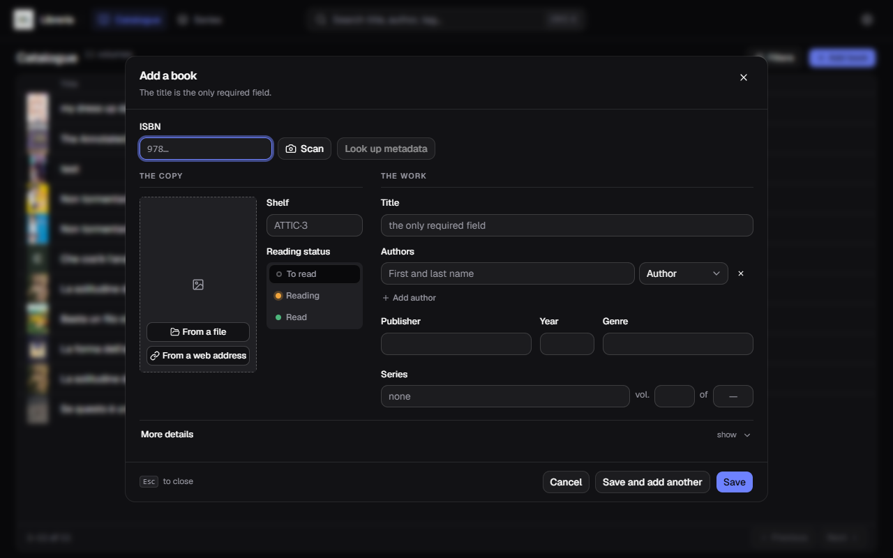
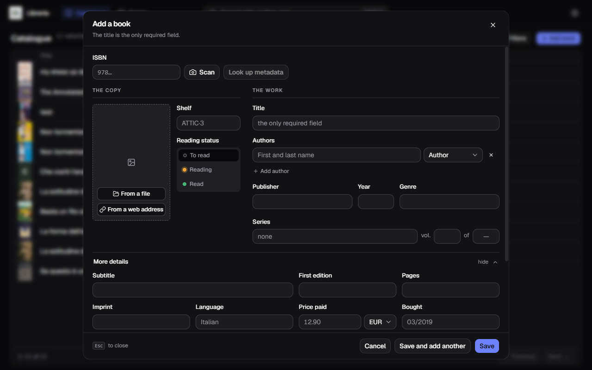
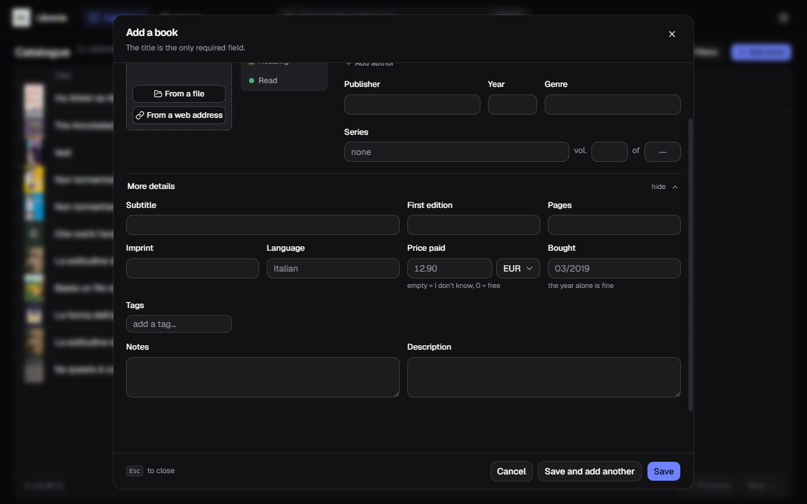
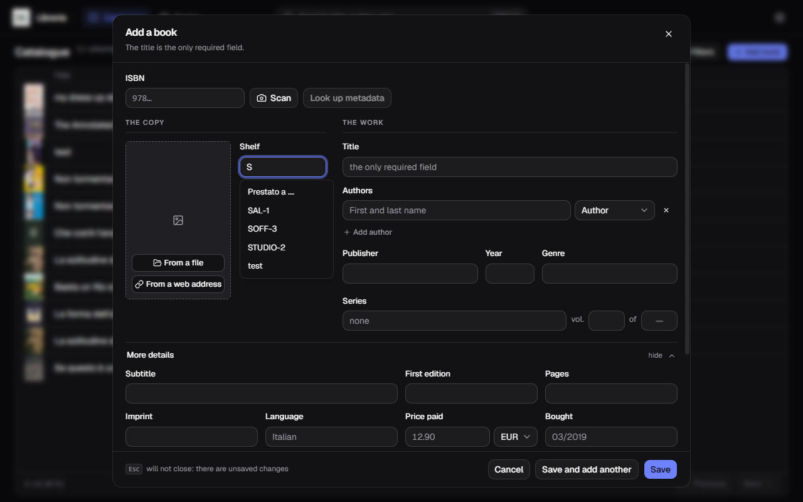
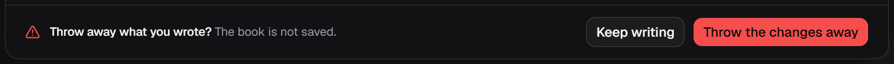
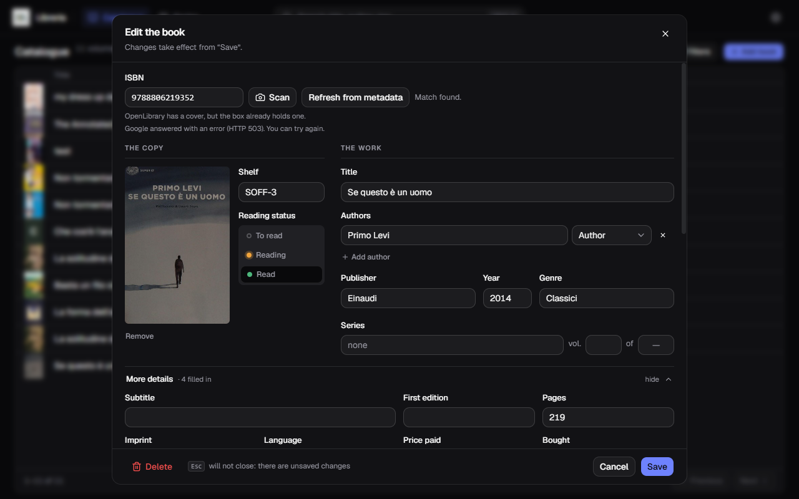

[Italiano](../it/Aggiungere-un-libro.md) · **English**

# Adding and editing a book

The **Add book** button sits top right in the catalogue. The same form reopens
from the pencil on a row, for editing.

**The title is the only required field.** Everything else can stay empty.

## How it is laid out

The form has two columns, and the split is not decoration:

- **The copy** — the one in your hands. Where it sits on the shelf, whether you
  have read it, what you paid, its cover.
- **The work** — the book as the world knows it. Title, authors, publisher,
  year, series.

Above the two columns sits the **ISBN** with the two buttons that do the work for
you: **Scan** (turns on the webcam) and **Look up metadata**.

## The ten always-visible fields

| Field | Notes |
|---|---|
| ISBN | 10 or 13 digits; the key metadata is looked up by |
| Shelf | free text: `SAL-1`, `Bedside`, `Lent to Marco` |
| Reading status | To read · Reading · Read |
| Title | **required** |
| Authors | one or more, each with a role (Author, Artist, Translator…) |
| Publisher | |
| Year | of this edition |
| Genre | just one |
| Series | the name, plus the volume number |
| Total volumes | how many volumes the series has altogether |

**+ Add author** adds a second author; the `×` on the right removes a row.

## More details

Ten further fields live under **More details**, collapsed at first. It opens by
itself when a metadata lookup has filled something down there — and the label
says how many fields were filled (`· 4 filled in`), so you know it is worth a
look.

Subtitle, first-edition year, pages, imprint, language, price paid with its
currency, when you bought it, tags, notes and description.

Two boxes deserve a line:

- **Price paid** — empty means «I don't know», `0` means «free»: two different
  things, and they stay apart. The currency is picked next to it, book by book;
  which one is the default is decided in [Settings](Settings.md).
- **Bought** — the year alone is fine.

## Suggestions as you type

Seven fields offer you what you have used before: shelf, genre, publisher,
imprint, language, series and tags. The first letter is enough.

This is not just convenience. Type `Manga` in one book and `manga` in another and
you end up with **two genres** splitting the counts in the filters. Taking the
suggestion keeps you on the spelling you already chose.

## Saving

Three buttons at the bottom:

- **Save** — saves and closes;
- **Save and add another** — saves and clears the form while staying open, with
  the webcam still running if you were scanning. This is how you catalogue a
  stack of books one after another;
- **Cancel** — closes without saving.

If you have written something, `Esc` and **Cancel** do not close straight away:
they ask.

## Editing a book that already exists

The pencil in the catalogue reopens the same form with the fields filled in.
Three differences:

- the lookup button reads **Refresh from metadata**, and what it finds does not
  overwrite what you have: it shows up as pills beside your values, and you
  decide field by field;
- **what you clear really is cleared.** The previous value does not survive: the
  empty box wins;
- **the one exception is the series' total volumes.** Clearing that box does not
  reset the total, because that number belongs to the series and not to this
  copy: resetting it while saving *one* volume would take it away from all the
  others. To really remove a total, go through [Series](Series.md).

**Delete** sits bottom left, away from Save.
