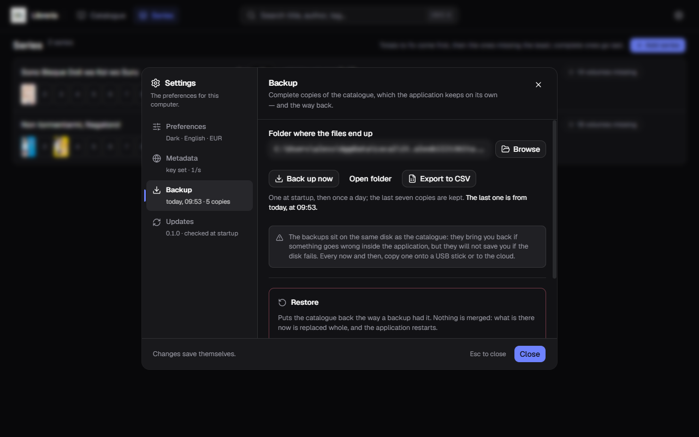
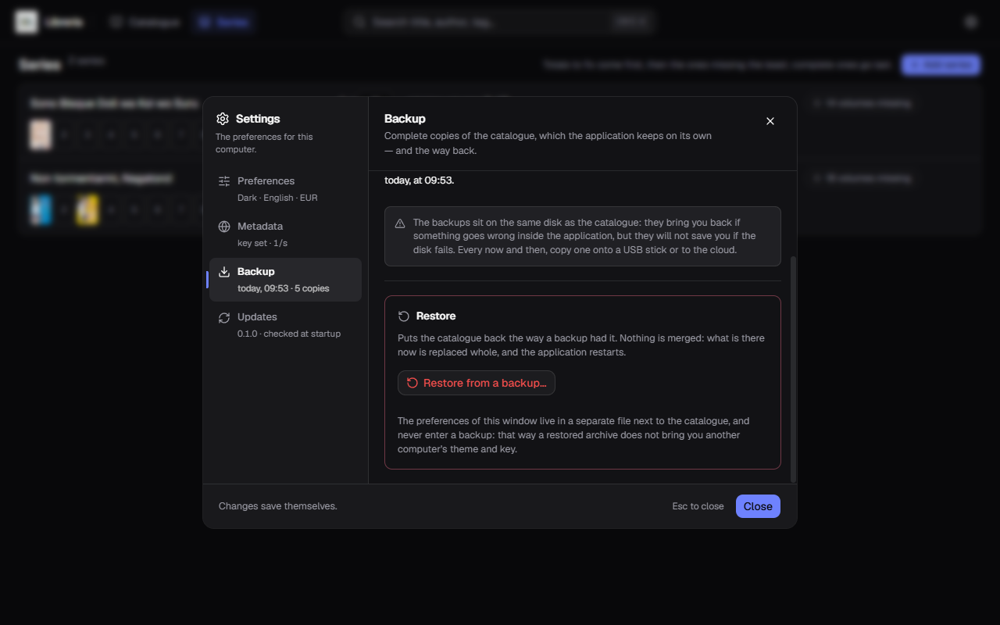

[Italiano](../it/Backup-e-ripristino.md) · **English**

# Backup, export and restore

All under **Settings → Backup**.



## The automatic backups

One **at startup**, then **once a day**. The **last seven copies** are kept: the
oldest goes on its own, so the folder does not grow forever.

Each copy is a `.zip` holding the catalogue **and the covers**, named by date:

```
libreria-2026-08-31.zip
```

**Back up now** makes one straight away, without waiting for tomorrow — handy
before a big import or a clear-out.

**Open folder** opens File Explorer where the files are.

If a backup fails, a warning appears at the top of the window that **does not
dismiss itself**: it is the only way you would notice.

### Where they end up

By default in `%LOCALAPPDATA%\it.alexkill536ita.gestionale-libreria\backups\`.
**Browse** picks another folder — a USB stick, a cloud-synced folder.

And here is the thing that matters:

> **The backups sit on the same disk as the catalogue.** They bring you back if
> something goes wrong inside the application, but **they will not save you if
> the disk fails.** Every now and then, copy one onto a USB stick or to the
> cloud.

Settings **do not go** into the backups: theme, language, API key and camera stay
with this computer.

## Exporting to CSV

**Export to CSV** writes a text file with **twenty-two columns**, one row per
book:

```
id;titolo;sottotitolo;autori;editore;collana;anno;anno prima edizione;
genere;tag;serie;volume;isbn;lingua;pagine;prezzo;valuta;acquistato;
posizione;stato di lettura;note;aggiunto il
```

The file is meant to **open cleanly in Italian Excel**: `;` separator, UTF-8 with
BOM, price with a decimal comma (`980,00`). Double-click and it opens already in
columns, with the accents where they belong.

The headers stay in Italian even with the application in English: it is an
interchange format, and a file that changes its header with the language does not
open the same way twice.

**A CSV is not a backup.** It holds no covers and cannot be restored: it is for
taking the data elsewhere — a spreadsheet, another application, a printout.

## Restoring



**Restore from a backup…** puts the catalogue back the way an archive had it.

**Nothing is merged.** What is there now is **replaced whole**: books added after
that backup are gone, along with their notes, prices and shelves.

How it goes:

1. you pick the `.zip` file;
2. the application **reads and checks it** before touching anything, and the
   confirmation names the file and both counts — how many books you have now and
   how many the archive holds;
3. if you confirm, **it first saves a backup of the current state**: if you
   picked the wrong archive, you can go back;
4. the catalogue is replaced and **the application restarts on its own**.

The restart is not a whim: the catalogue is open while you use it, and replacing
it live would corrupt it. The real swap happens at the next startup, before
anything opens it.

A damaged archive, or one that holds no valid catalogue, is **refused** at the
reading stage: the current catalogue is not touched.

## If the computer dies

On the new computer:

1. [install the application](Installation.md) and open it once;
2. Settings → Backup → **Restore from a backup…**;
3. pick the `.zip` you had put aside.

Books and covers come back. Theme, language, currency, API key and camera do
**not**: those you set again by hand, in a minute.
