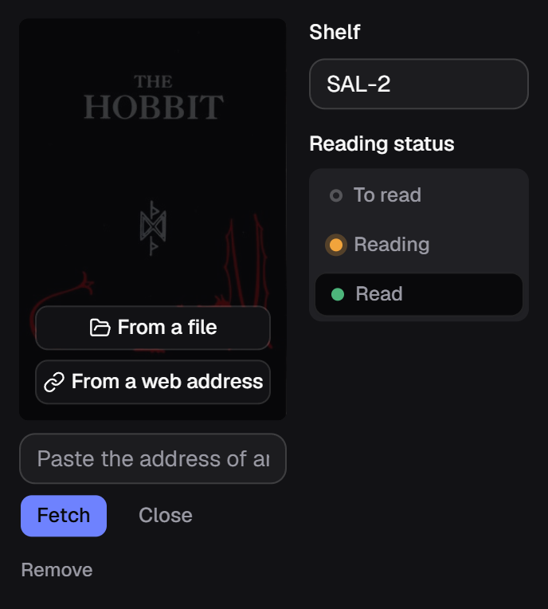
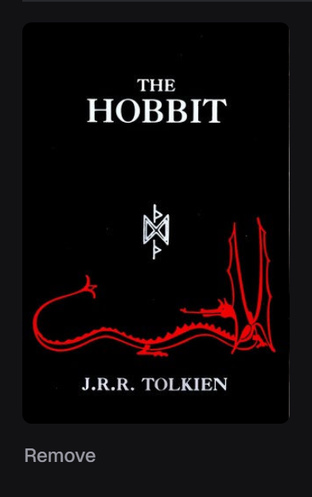

[Italiano](../it/Le-copertine.md) · **English**

# Covers

The dashed box on the left of the form. There are three ways in.

## 1. On its own, while looking up metadata

When the box is empty and [the metadata lookup](Looking-up-metadata.md) finds an
image, it comes down without you pressing anything. This happens with
**OpenLibrary**, with **NiceBooks** and with **AniList** — and the line under the
ISBN always says whose the image is.

If a cover is already there it is not replaced: a line under the ISBN tells you
— *«OpenLibrary has a cover, but the box already holds one»* — and if you do want
it, remove the current one and look up again.

**Google Books images are not downloaded**, even when Google has them: their API
terms do not allow rehosting them. This is not a technical limit and retrying
will not help.

## 2. From a file on disk

**From a file** opens the Windows dialog. It takes a JPEG or a PNG and copies it
into the covers folder: from then on it is safe even if you move or delete the
original.

## 3. From a web address

**From a web address** opens a box to paste an image URL into, and **Fetch**
downloads it.

The file always lands in the data folder: **the catalogue keeps no links to
other people's images**, so the cover survives even when that site closes down.

## Books with no cover

You do not get a hole: the application draws a spine with **the title's first
letter**, on one of eight colours picked **from the publisher**. Two books from
the same publisher get the same colour, which makes an imprint recognisable at a
glance; a book with no publisher gets a neutral grey.

In a series row the drawn spines mark the volumes you are missing — see
[Series](Series.md).

## Removing a cover

**Remove** sits under the image. The file leaves the disk when you save.

## Where they live

In `%LOCALAPPDATA%\it.alexkill536ita.gestionale-libreria\covers\`, one JPEG per
book with a random name. **They go into the backups**, so a restored archive
brings them back with it.

Images are re-encoded to JPEG at their original resolution: they are not shrunk,
but a 12 MB PNG does not stay 12 MB.
