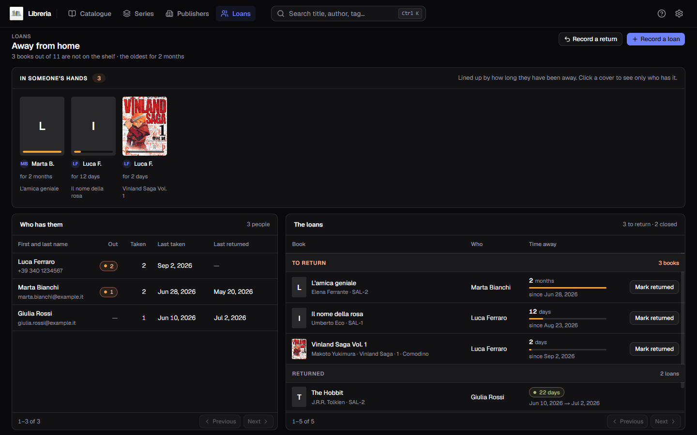
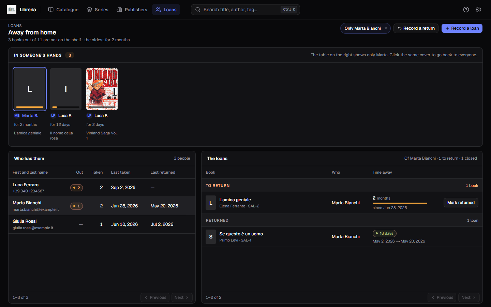
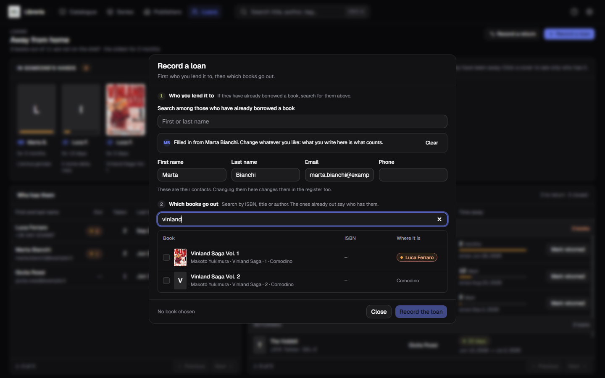
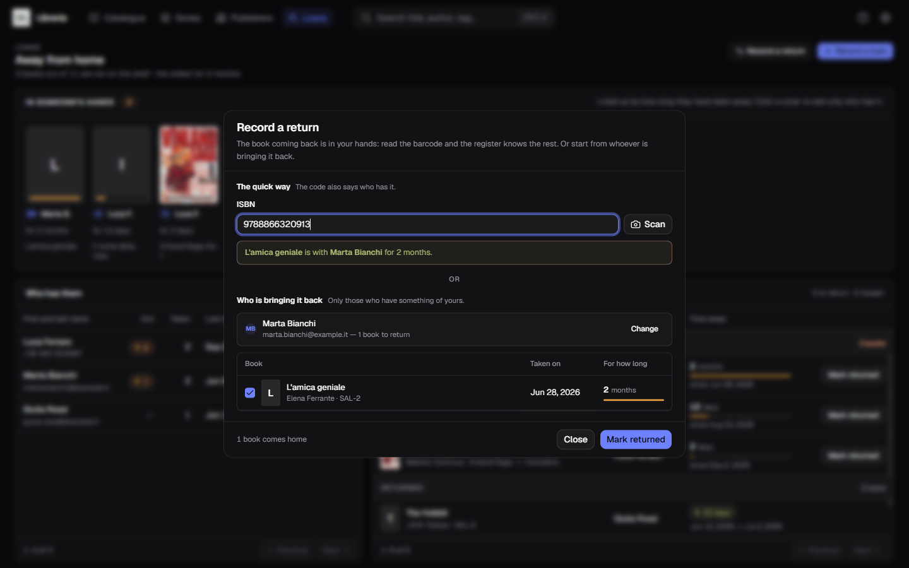
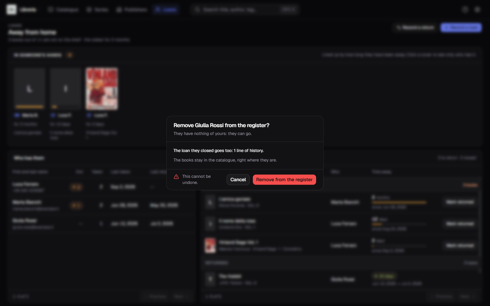

[Italiano](../it/I-prestiti.md) · **English**

# Loans

The **Loans** entry in the bar answers one question: **where did that book end
up?**

It is the only page that talks about what is *not* on the shelf. At the top it
says how many books are away and for how long — *“3 books out of 11 are not on
the shelf · the oldest for 2 months”* — and below it shows who has them.

A loan is only born here, with **Record a loan**. Until you record one, the page
is empty and explains how to start.

## In someone's hands

Under the title there is the strip of books that are out: one cover per volume,
**lined up by how long they have been away** — the oldest first. At the foot of
each cover a thread shows how much time has passed, and below it the name of
whoever is holding it.

**Click a cover and the loans table narrows down to whoever has that book.** The
other covers stay lit: an active filter is no reason to make the inventory
unreadable. The `Only Marta Bianchi` pill appears at the top right, and its `×`
— or a second click on the same cover — goes back to showing everyone.

The strip does not paginate, and it does not need to: **a copy can only go out
once**, so the books that are away can never outnumber the ones in your
catalogue.

## Who has them

On the left, the list of people. A row carries the first and last name, the
contact below it, and then four numbers:

| Column | What it says |
|---|---|
| **Out** | how many of your books they have right now |
| **Taken** | how many they have borrowed in all, ever |
| **Last taken** | the date of the most recent loan |
| **Last returned** | the last time they brought something back |

**Whoever has returned everything stays in the list.** It is not a leftover: it
is the one piece of information that matters the day you lend them the next book
— how many they have borrowed, how it went, what their name really is.

Clicking a row does the same thing as a cover in the strip: it narrows the table
on the right down to that person.

## The loans

On the right, **a single table** with four columns: the book, who has it, the
time away, and the last cell. First the loans **to return**, then the **closed**
ones, split by a divider that says how many they are and stays stuck under the
header while you scroll.

The columns are the same for both groups: what changes are the last two cells.

- an **open** loan carries the time with its thread and the **Mark returned**
  button, which closes it in one click;
- a **closed** loan carries the pill and the interval between the two dates —
  `Sep 4, 2026 → Sep 12, 2026`.

At the bottom there is **a single footer for both lists**, fifty rows at a time,
with the same count as the catalogue: `1–50 of 62`. A group's divider shows up
where the page actually has rows of that group, so on page 2 you may well see
only *Returned*; the counts in the header and on the dividers, instead, stay the
counts of **everything**, not of the page — they say how many there are, not how
many you can see.

## Recording a loan

**Record a loan**, at the top right. The dialogue has two steps, and it always
starts from the person.

### Who

The box at the top **searches among those who have already borrowed a book**, and
proposes in a drop-down list. Accepting a proposal fills in the four fields below
— first name, last name, email, phone — on its own, and the line *“Filled in from
Luca Ferraro”* says where they come from. What you write still counts for more:
change whatever you like, or press **Clear** and start again by hand.

The contacts you edit here **change in the register too**: this is the right
place to fix an old phone number.

If you search for a name and there are two of them, **nothing gets filled in**
and you see both: filling in the wrong Marco's surname is worse than not filling
it in at all.

Whoever is not in the register yet joins with the first loan: writing the name is
enough. One contact is all it takes — email **or** phone.

### Which books

The second step stays off until there is a name. Then you search the catalogue
**by ISBN, title or author**, and pick as many as you like: one loan can carry
away three volumes at once.

Books that are **already out show up greyed**, with the name of whoever has them:
they are not lent twice.

## Recording a return

**Record a return** has two ways, and it creates nobody — whoever is returning
necessarily has a book of yours already.

### The barcode

The quick way: the same panel as the [scanner in the
form](Scanning-the-barcode.md), you frame the code and the register knows the
rest. There are **three** outcomes, and the third is not an error:

| What it says | What it means |
|---|---|
| *“Berserk Vol.1 is with Luca Ferraro for 2 months”* | the book is out, and its loan is already ticked |
| *“… is at home, in SAL-1: there is nothing to return”* | the book is here, on the shelf |
| *“No book with the code …”* | that code belongs to no book in the catalogue |

The third happens more often than it sounds, and it is almost always the book's
fault, not yours: **a volume has two or three codes printed on it** — the price,
the shop's own code — and the scanner reads what it sees.

The code finds the book and ticks its loan, but it **confirms nothing by
itself**: the confirmation stays your gesture, because a reader saving on its own
would close a loan on the wrong reading.

### The person

The other way: you write who is bringing it back, and you see **only their books
that are out**. You tick the ones that have come back and confirm. Anyone with
nothing of yours does not show up.

## Removing a person from the register

The last column of the list, which appears when you hover over the row.

**It can only be done empty-handed.** As long as they have something out the
button is off and says how much: *“Marco Bianchi still has 2 books of yours: get
them back first”*. This is not a courtesy of the interface — it is the program
refusing, because the open loan is the only thing keeping that book off the
shelf, and taking it away would make the book lendable again while it sits in
somebody's house.

The confirmation says in full what happens:

- **their history goes too** — the loans they closed, counted line by line;
- **the books stay in the catalogue**, right where they are: they had already
  come back.

This cannot be undone.

## A lent book shows in the catalogue too

You do not need to come here to know that a book is out. In the
[catalogue](The-catalogue.md) the **Read** cell says so: a mark appears next to
the reading state, and hovering over it reads out the whole thing — *“Luca
Ferraro · lent on Sep 4, 2026 (today)”*.

In the [filters panel](Search-and-filters.md) there is the **Loan** facet, with
`on loan` and `at home`: it is the way to see everything you are missing in a
single screen.

**A book that is away cannot be deleted**, and not even the series that contains
it can take it away: the bin refuses and names whoever has it. Get it back first.

## Two things the register does not do

**There is no due date.** In a home library nobody gets fined: there is no
“return by”, nothing turns red and nothing expires. What the register tells you
is that this volume has been out for eight months, and what to do about it is up
to you.

**A loan sits on a book, not on a title.** If you have two copies of the same
volume, one can be out while the other is on the shelf: the register knows which
of the two you gave away.
