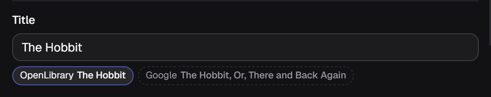
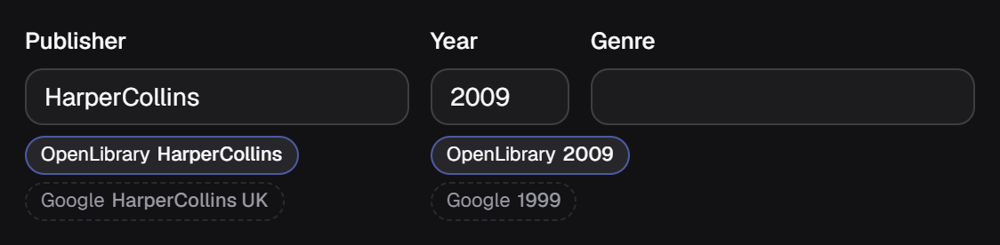
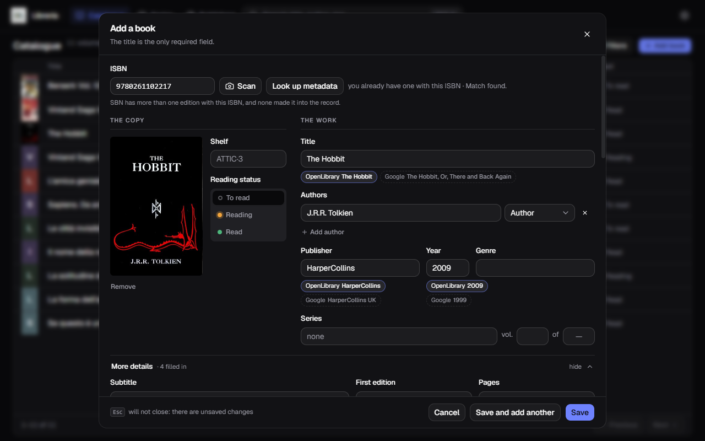
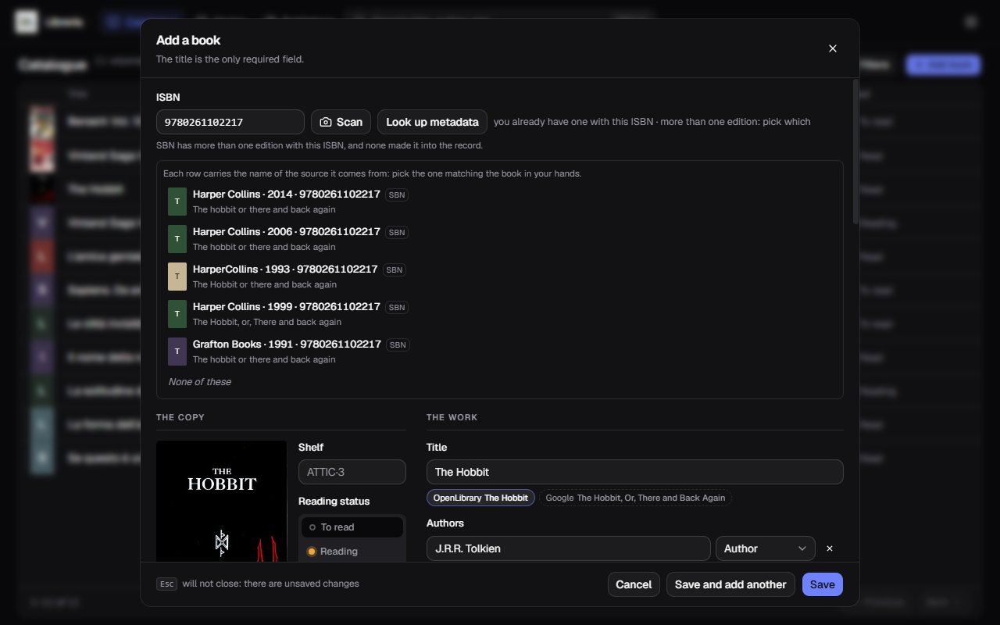
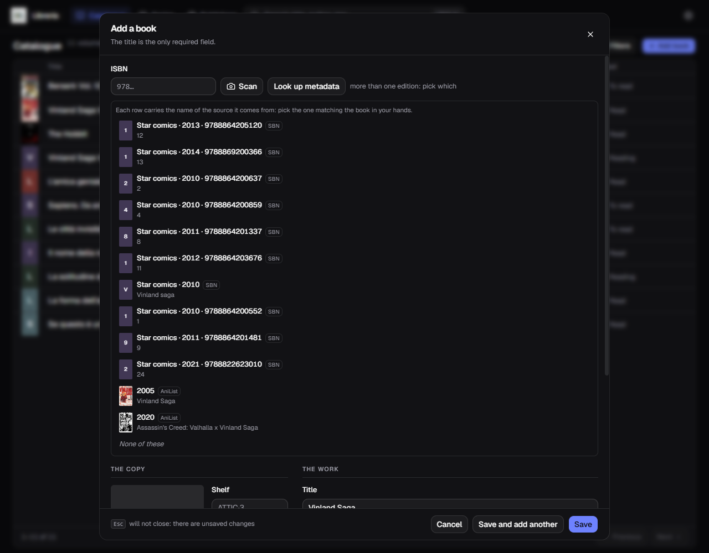
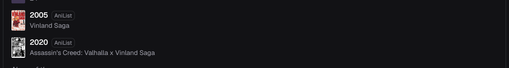
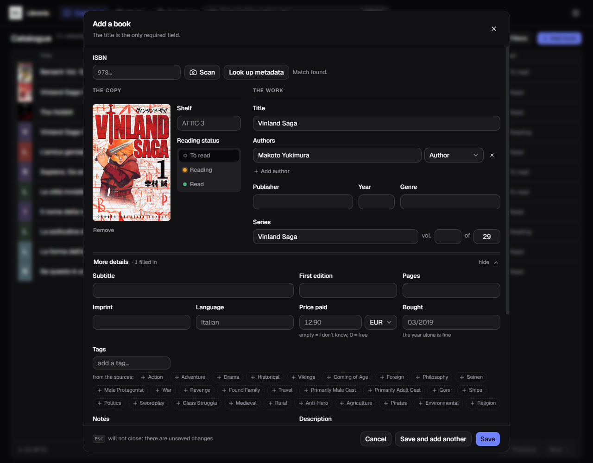

[Italiano](../it/Cercare-i-metadati.md) · **English**

# Looking up metadata

One button, **Look up metadata**, and it works out where to start on its own:

- if there is an **ISBN**, the ISBN wins;
- otherwise it looks at **title and authors** and searches by title.

It is greyed out only when there is neither. `Enter` inside the ISBN field does
the same thing. On a book you are editing the same button reads **Refresh from
metadata**.

## The five sources

| | Source | What it gives |
|---|---|---|
| 1 | **OpenLibrary** | leads the cascade, and brings the cover too |
| 2 | **Google Books** | knows niche Italian publishing |
| 3 | **OPAC SBN** | the Italian library catalogue |
| 4 | **NiceBooks** | the Italian publishing the others do not have, manga included |
| — | **AniList** | manga and Japanese comics, **outside** the cascade |

The first four are queried **all four together**, not one after another. The
first one leads: the others only fill in the fields it left empty.

**NiceBooks comes last because it fills the other three's gaps**, and it is
often the only one that knows anything about Italian manga and small publishers.
There is nothing to set up, and it brings the cover too when OpenLibrary has
none. In exchange it is the slowest: for every book it asks twice instead of
once, so it adds **a couple of seconds** to each ISBN.

AniList sits outside because **it does not know ISBNs** — it catalogues works,
not editions. It only shows up in the search by title, where you pick the right
row yourself.

## When the sources disagree

A **pill** appears under the field for each differing value, carrying the name of
the source it came from. The chosen one has a lit border; the others are dashed.
One click takes the other.

Here the title comes from OpenLibrary, and Google offers something different: one
click on the dashed pill and you take theirs.

On the publisher OpenLibrary says `Bompiani` and Google says `Clube de Autores`;
on the year Google says `2025` and SBN says `2014`. Neither is right by
definition: you look at the book in your hands and choose.

The whole record after a successful lookup:

The cover came down on its own, and each contested field has its pill.

## When an ISBN has more than one edition

Sometimes a source knows several editions under the same ISBN and cannot tell
which is yours. Rather than guess, it lines them up.

Each row carries publisher, year, ISBN and **the name of the source**. Pick the
one matching the book in your hands, or **None of these** and fill in by hand.

Above the list, in plain words, is also the report of how each source did:
`OpenLibrary does not know this ISBN`, `Google answered with an error (HTTP
503)`. These are not faults in the application: they are the catalogues'
answers.

## Searching by title

If nobody knows the ISBN — or you do not have it — type the title and press the
same button. The title search also starts by itself when the ISBN cascade comes
back empty and the form already holds a title or an author.

The **SBN** and **NiceBooks** rows carry publisher, year and the Italian
edition's ISBN, with the volume number on the left. Scroll to the bottom of the
list and you find the **AniList** ones, with the cover thumbnail and the year of
the work. Every row says which source it comes from.

## Manga from AniList

Picking an AniList work brings things none of the other four can give:

- **the cover**, downloaded right away;
- **author and artist told apart**, when they are two different people;
- **the series name and total volumes** — here `Vinland Saga`, `29`;
- **genres and tags**, in English, offered under the Tags field: click the ones
  you want to keep;
- the description, stripped of its HTML.

What AniList does **not** have, and will stay empty: publisher, imprint, pages,
price and the year of the Italian edition. Those come from the other sources, or
from you.

## What you typed is not overwritten

**It does not matter whether you are adding or editing: what matters is whether
the form already holds something.** If it does, the values found **do not write
over them** — they appear as pills next to yours, and you decide field by field.
An empty form is filled straight in, because there is nothing to confirm.

It holds for **authors** too: a source's proposal arrives as a single pill, with
the names joined by `·` and not by a comma — which inside «Miura, Kentaro» would
split one surname into two people. Pick it and the names go back to separate
rows.

## If it finds nothing

Not every source knows everything. Italian non-fiction from small publishers and
certain niche editions are nowhere to be found: in that case you fill the form in
by hand, the way it has always been done.

For the sources' settings — the Google Books key, the contact address for
OpenLibrary — see [Settings](Settings.md).
