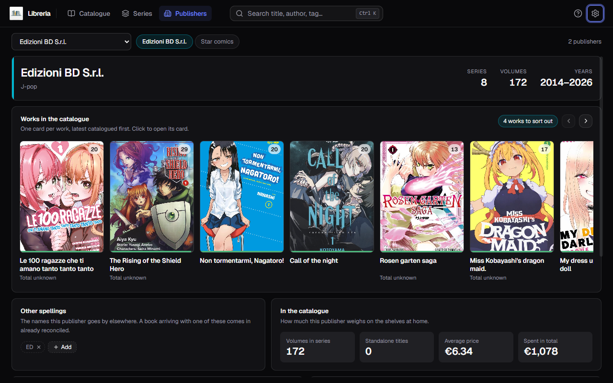
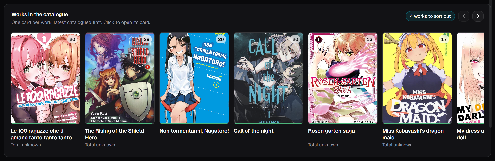
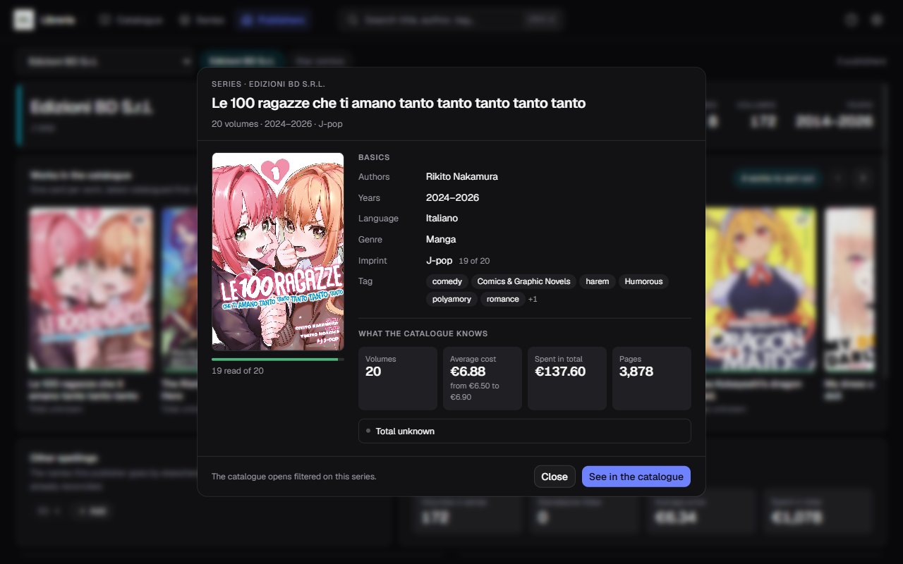
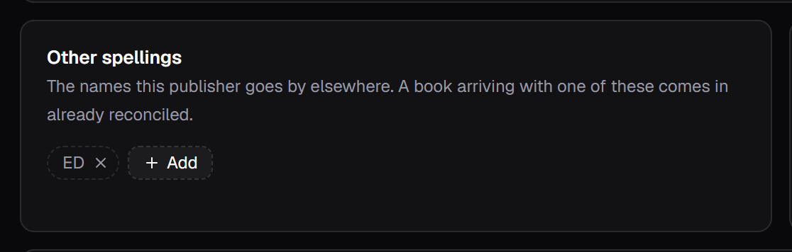
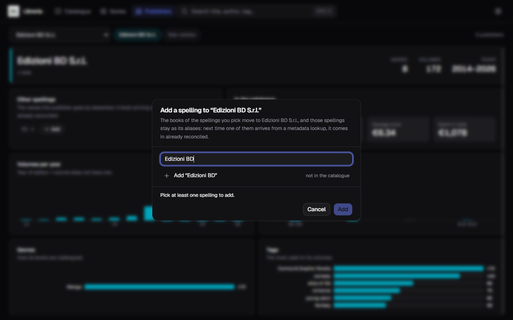
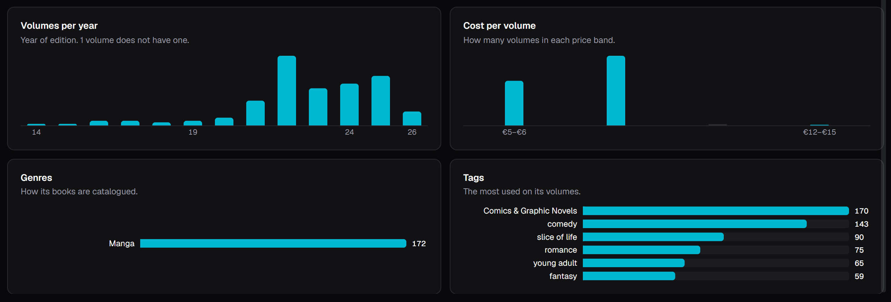

[Italiano](../it/Gli-editori.md) · **English**

# Publishers

The **Publishers** entry in the bar looks at the catalogue from one side only:
**one publisher at a time**. Who it is, how much it weighs on your shelves, and
which names it goes by.

A publisher shows up here as soon as a book in the catalogue carries its name.
There is nothing to set up first.

## Picking who to talk about

Top left, the dropdown with every publisher, and next to it the pills of the
**five biggest ones**, so you do not have to go looking. On the right, how many
there are in all.

Below it, the card: the name, the **imprints** it publishes, and on the right
three numbers — how many **series**, how many **volumes**, and the **span of
years** of the editions you own. Every publisher has a tint of its own, taken
from its name, and its charts carry it.

## Works in the catalogue

Below the card, the strip of its **works**: one card per work, not per volume.

A **series** stands for all of its volumes: it shows the cover of the **first**
one, the title of the work, and top right the pill with **how many you own**. A
**standalone title** stands for itself and has no such pill: that is how the two
tell each other apart, without a word more. The thread at the foot of the cover
says how many volumes you have read.

The order is that of the **latest volume catalogued**: at the front is whatever
you have just put in, and a series card climbs back to the front every time you
add a volume to it. It is not the order in which you discovered the publisher, it
is "what have I catalogued lately".

**A card stays quiet when the series is in order**, and speaks in a single line
when it is not:

| | |
|---|---|
| *4 volumes missing* | the series total is known and you are not there yet |
| *Total unknown* | nobody has said how many volumes there are in all |
| *The series total says 15* | you have catalogued more than the series declares |
| *Single title* | it is not a series |

The first three are also what the pill top right counts — *"5 works to sort
out"* — and that pill is the only place in the strip where the publisher's tint
comes in. A wrong or missing total is fixed from [**Series**](Series.md).

**Clicking a card opens the work's record**: the cover, the basic data — authors
with their role, years, language, genre, imprint, tags — and what has been
gathered, that is how many volumes you have, what they cost on average and in
total, how many pages, and where the series stands.

For a series the values are **the sum of its volumes from this publisher**, and
where the volumes disagree the record says so next to the value: *«Italian 15 of
16»* means fifteen volumes out of sixteen are in Italian, not that the series
is. Where no tally appears, it holds for all of them.

The filtered catalogue has not gone: it is **See in catalogue** at the foot of
the record, one click further on, where you get to it after seeing the numbers.

The arrows top right show up **only if there is really something to scroll**:
with few works there is no dead control taking up room. The strip also scrolls
with the wheel and with `Tab`.

## Other spellings

This is the part that matters, and it is not cosmetic.

The same publisher arrives from the metadata sources under different names —
`Einaudi` from one, `Giulio Einaudi Editore` from another — and no comparison
between words will ever join them. What you get is a split filter facet, with
half the books on each side.

The **Other spellings** panel lists the names that publisher goes by elsewhere.
The line under the title says what they are for: *"A book arriving with one of
these comes in already reconciled"*.

**An alias is not the history of a merge done once: it is a rule about what will
come in tomorrow.** The books you had have already moved to the good name; the
rule is there so the next metadata lookup does not bring the wrong spelling back.

## Adding a spelling

The **+ Add** pill, at the end of the row, opens the dialog. The target is always
the publisher you are looking at.

The box does **two things**:

- it **searches** among the spellings the catalogue already has, and you tick
  them;
- it **writes**. If no book carries the name you want to register yet, type it in
  full: it shows up at the top as *"Add "…""* and `Enter` puts it among the
  choices.

The second one is what you need most often, and it is why this is not a closed
list: double spellings are brought in by the **metadata cascade**, and the rule
has to be registered **before** that name arrives.

The line at the bottom always says what will happen: *"12 books move to Edizioni
BD S.r.l."*, or *"No book changes: the rule for what comes next is left"*. The
button reads **Add** from the start through to the confirmation.

The `×` next to a spelling **forgets** it. Forgetting an alias brings no book
back: those already carry the good name, and what you remove only concerns what
is yet to arrive.

## In the catalogue

Four numbers, answering "how much does this publisher weigh in my house":

| | |
|---|---|
| **Volumes in series** | how many of its volumes belong to a series |
| **Standalone titles** | how many stand alone |
| **Average price** | per volume |
| **Spent in total** | the sum of what you paid |

The two that talk about money look at **one currency only**, the one you use most
with that publisher. If some volume is priced in another, the page says so and
leaves it out: adding euros to yen would give a number that means nothing.

## The four charts

| | |
|---|---|
| **Volumes per year** | year of **edition**, not of purchase; it says how many have one |
| **Cost per volume** | how many volumes in each **price band** |
| **Genres** | how its books are catalogued |
| **Tags** | the most used on its volumes |

Cost is a **distribution across bands, not an average**, and the difference
shows: an average price of €6.34 does not tell apart someone who prints
everything at that price from someone who alternates paperbacks and boxed sets.

There is no legend, and the colour is one: in a sorted chart the length of the
bar already says everything. Under each chart the same information sits as a
table, for anyone reading with a screen reader.

## Why merging touches series too

When one spelling flows into another, the publisher of the **series** that
carried it changes as well. That is not a detail: a series' publisher is what the
series *dictates* to the volumes joining it, and leaving it stale would let the
spelling you just fixed come back in with the first volume you catalogue.
