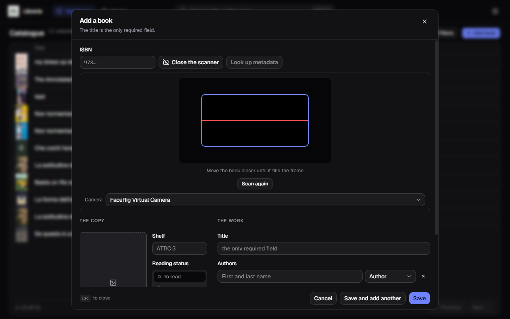
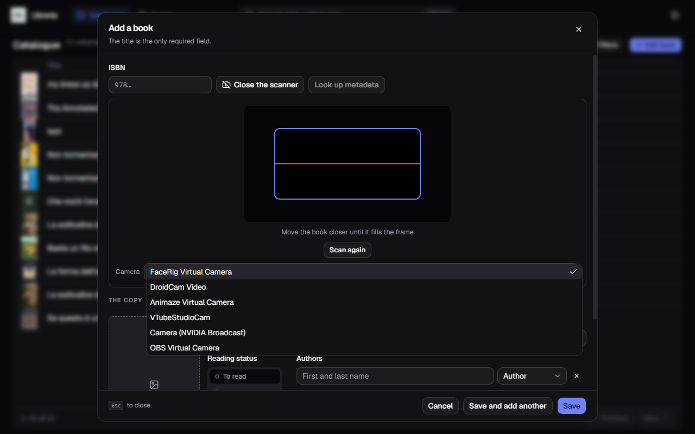

[Italiano](../it/Scansionare-il-codice-a-barre.md) · **English**

# Scanning the barcode

The **Scan** button, next to the ISBN field in the form, turns on the webcam and
reads the barcode off the back cover.

## How to use it

1. **Scan** opens the viewfinder inside the form.
2. Bring the book closer until the barcode **fills the blue frame**: that is the
   part of the image being looked at, and a small code in the middle of the shot
   will not do.
3. As soon as it reads, the ISBN writes itself into the field and **the metadata
   lookup starts**. You do not press anything else.
4. Fill in what is missing — shelf, price, reading status — and save.

With **Save and add another** the form empties but **the camera stays on**: this
is how you catalogue a stack of books without reopening anything.

**Scan again** puts it back into listening after a read, if you framed the wrong
book. **Close the scanner** turns the webcam off.

You can always type the ISBN into the field below instead: the viewfinder forces
nothing on you.

## The viewfinder is black

This is the commonest case, and it is almost never a fault: Windows has picked a
**virtual camera** on its own — OBS, FaceRig, NVIDIA Broadcast, DroidCam — that
is not sending anything. In the picture above, that is exactly what happened.

The cure is the **Camera** dropdown under the viewfinder.

Pick the real one — usually named after the model, something like
`PC-LM1E Camera` — and the viewfinder lights up. The choice is remembered for
next time.

If the list shows a single unnamed entry, camera permission has not been granted
yet: grant it and reopen the panel.

## It will not read the code

In order, the causes you actually run into:

- **the code does not fill the frame** — move the book closer, it is nearly
  always this;
- **glare** off the cover's plastic: tilt the book, or move away from the lamp;
- **a damaged or badly printed code** — happens on second-hand books. Type the
  thirteen digits by hand: they are printed in plain text under the bars;
- **the book has no ISBN.** Books from before the 1970s do not have one, and
  there is nothing to scan: search by title, as described in
  [Looking up metadata](Looking-up-metadata.md).

## An ISBN you have already catalogued

If the same code is read twice in a row, the second is ignored with a note: that
is the webcam seeing the same book for thirty frames, not you scanning twice.

If instead the ISBN is already in the catalogue, the application **tells you but
does not stop you**: two copies of the same book are two legitimate items, and
maybe one is out on loan.
