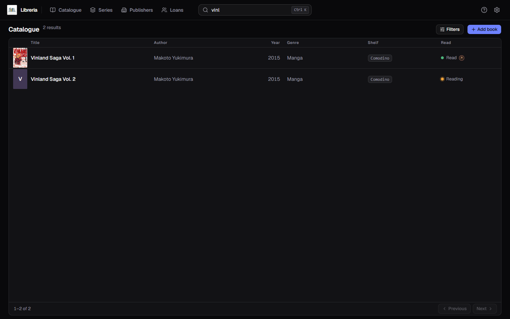
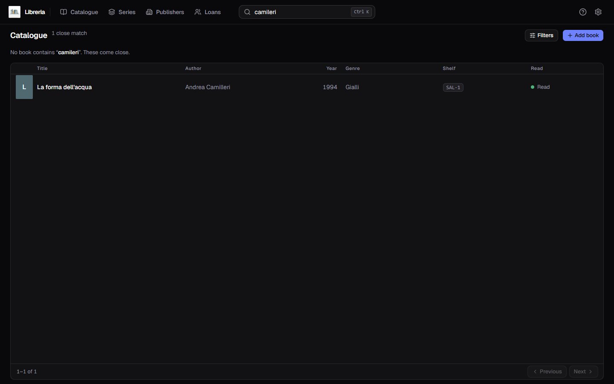
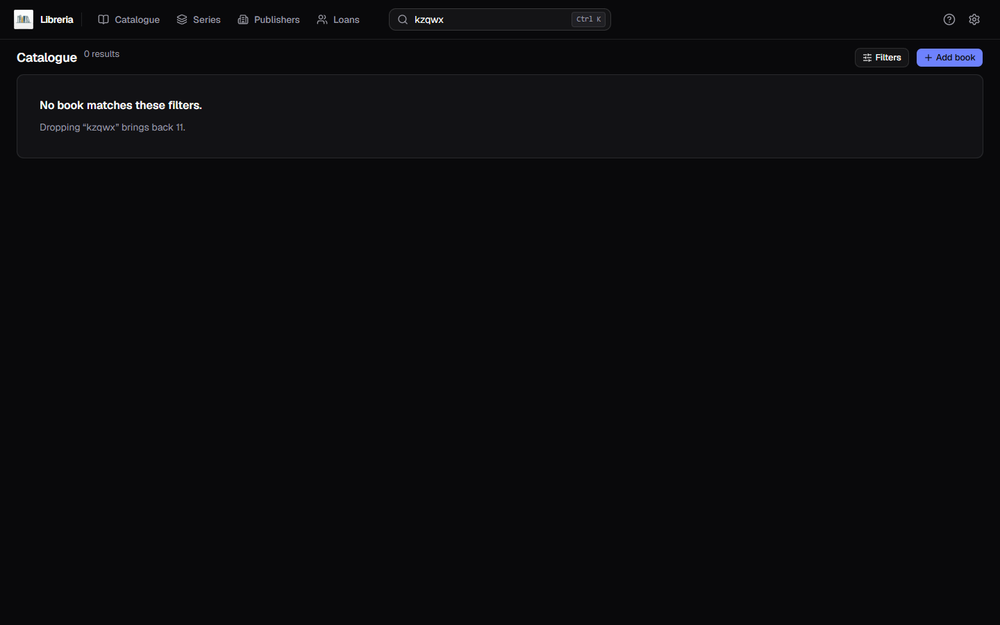
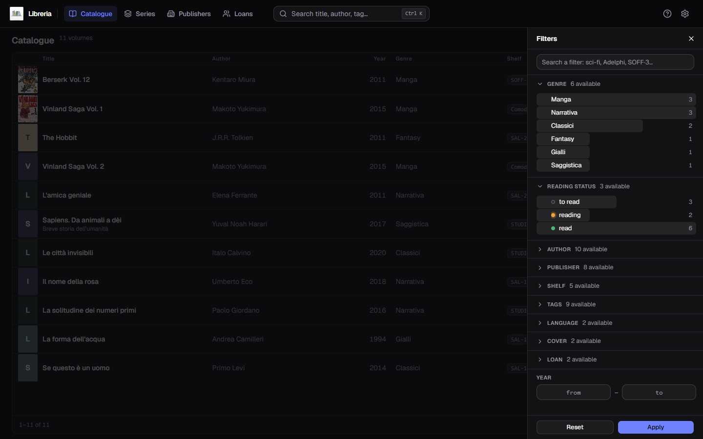
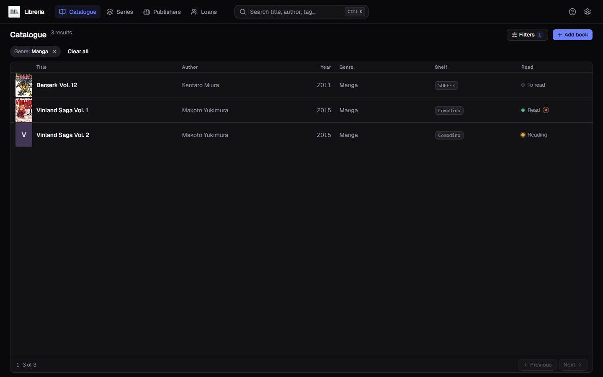

[Italiano](../it/Cercare-e-filtrare.md) · **English**

# Search and filters

Two separate tools: the **top bar** searches the text, the **Filters panel**
narrows by facet. They add up.

## The search bar

In the middle of the bar, always there. It searches as you type, no `Enter`
needed. `Ctrl K` puts the cursor in it from anywhere.

It looks inside **title, subtitle, authors, tags, publisher, imprint and notes**.
You do not need the whole word: two or three letters will do.

Left out are the description and the series name: for series there is
[a page of its own](Series.md).

### When you mistype

If the exact search finds nothing and you typed at least three characters, a
second pass runs that **forgives one typo** and shows the books that come close,
saying so above the table.

`camileri` is in no book, but *«No book contains "camileri". These come close»*
and Camilleri shows up underneath.

### When there really is nothing

The message always tells you **what to remove** to see something again.

## The filters panel

The **Filters** button opens a panel on the right.

Ten ways to narrow down:

| | |
|---|---|
| **Genre** | with the book count next to each |
| **Reading status** | to read · reading · read, counted too |
| **Author** | |
| **Publisher** | |
| **Shelf** | where the book is |
| **Tags** | |
| **Language** | |
| **Cover** | with or without |
| **Loan** | on loan · at home |
| **Year** | a range, `from` and `to` |

**Loan** keeps both of its counts on screen, even when one of them is zero:
`on loan 3` next to `at home 190` is already the answer, and clicking it leaves
you with a catalogue of what you are missing. Who has which book is told by
[Loans](Loans.md).

At the top there is a box to **search a filter**, which earns its keep when the
tags number twenty-nine and scrolling them is slower than typing three letters.

The sections past the first two start collapsed: one click on the row opens them.
The number next to the heading (`AUTHOR 10 available`) says how many values there
are to choose from.

**Apply** closes the panel and filters; **Reset** clears everything.

The counts are not decoration: they tell you in advance how many books will be
left, so you do not apply a filter only to find it leads to zero.

## The chips

Active filters stay in sight under the title, one chip each.

The `×` on a chip removes just that filter; **Clear all** removes the lot. The
Filters button carries a counter, so you know how many are still on even with the
panel closed.

**A chip can also arrive from elsewhere.** A series name in
[**Series**](Series.md), and a carousel card in
[**Publishers**](Publishers.md), open the catalogue already filtered: the
`Series:` chip is there to say why you are seeing those books, and it comes off
like any other.

## Search and filters together

They add up: the search looks inside the books the filters let through. When you
get zero results with a filter on, the message talks about the **narrowed
search**, not the whole catalogue — and tells you which one to drop.

## Case and accents

They do not matter. `citta studi`, `Città Studi` and `CITTÀ STUDI` all find the
same things. This holds both in the bar and in the filters.
