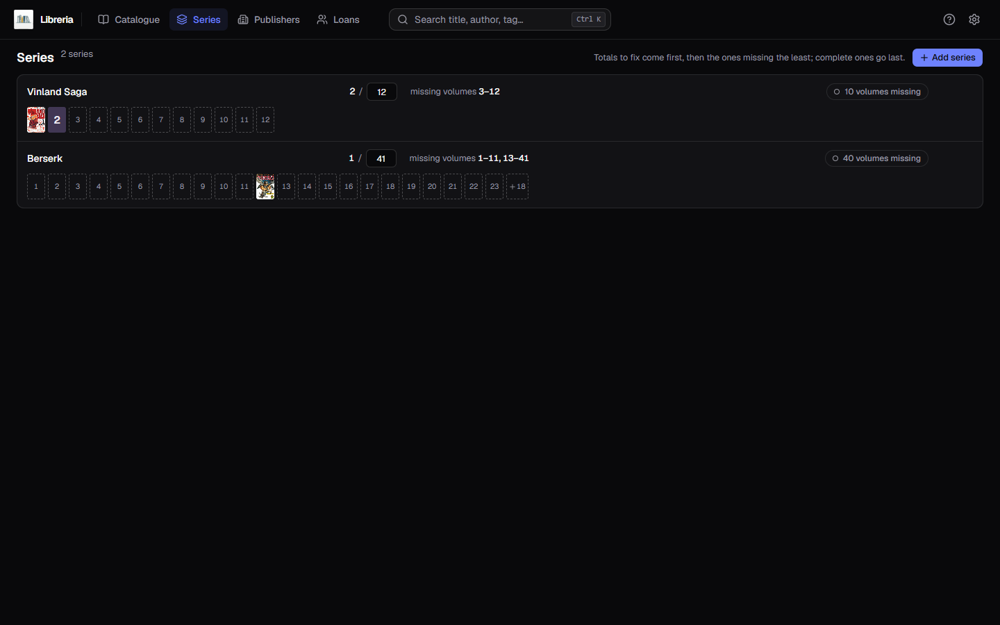
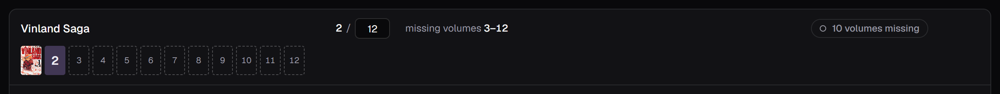
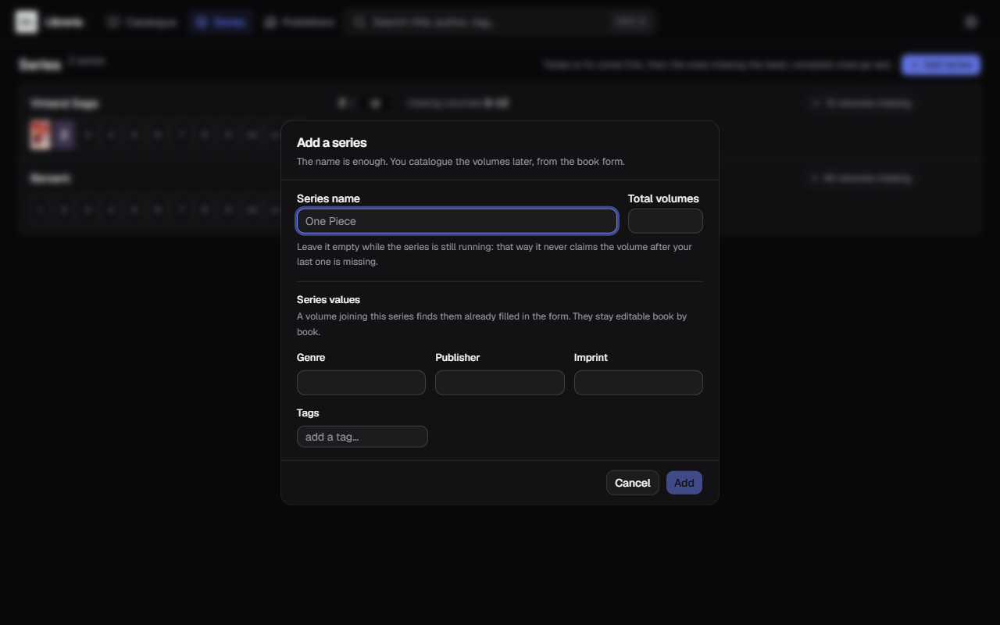
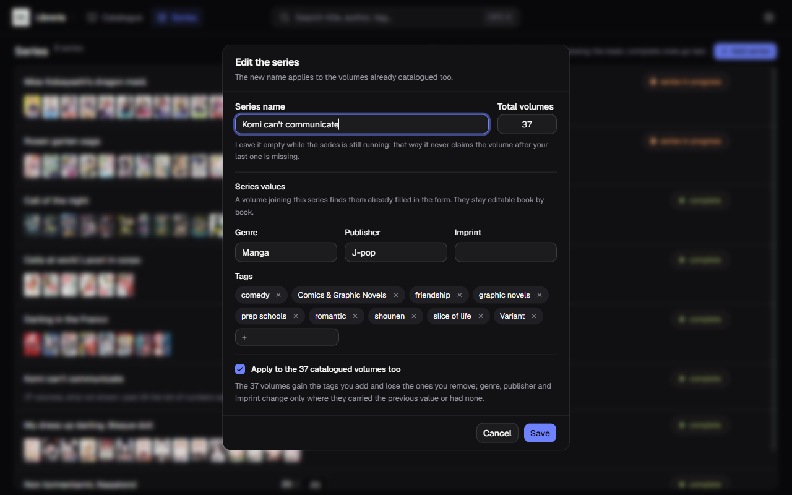
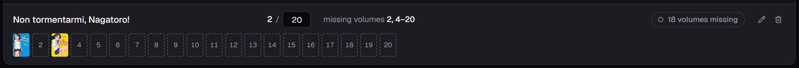
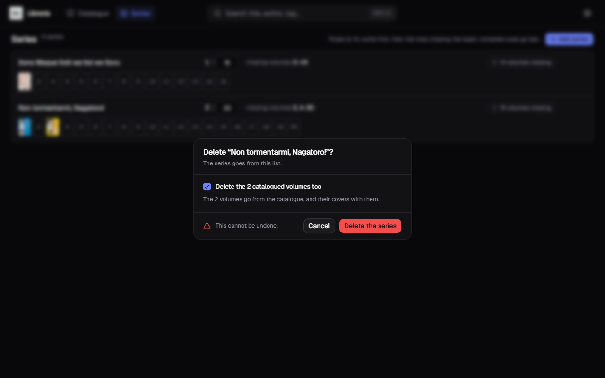

[Italiano](../it/Le-serie.md) · **English**

# Series

The **Series** entry in the bar answers one question: **which volumes am I
missing?**

A series turns up here as soon as you type its name in a book's form. There is
nothing to set up first.

## How to read a row

From the left:

- **the name** of the series;
- **how many you have out of how many** — `2 / 20`. The total sits in an editable
  box: correct it right there, it saves itself;
- **which ones are missing**, with the gaps merged: `missing 2, 4–20` instead of
  eighteen numbers in a row;
- on the right, the pill with the tally: `18 volumes missing`;
- underneath, **the row of spines**: real cover for the volumes you have, dashed
  box with the number for the ones you do not.

The list is not alphabetical: **wrong totals come first** — the series where you
hold more volumes than the total claims, which is the sign of a wrong total —
then the ones missing the least, and the complete ones last.

## Adding a series

**Add series**, top right.

The name is enough. The total can be left empty, and it is worth doing while the
series is still running: with no total, the application will never tell you that
the volume after your last one is missing.

Underneath sit the four values of the section below — tags, genre, publisher and
imprint — which you can fill in right away or let the series learn on its own.

The volumes get catalogued later, from a book's form, by typing that name in the
Series field.

## The series' values

Besides the name and the total, a series carries four things of its own: **tags,
genre, publisher and imprint**. There is nothing to declare: **the series learns
them from the volumes you assign to it.**

- **tags** add up — each volume's tags join the series, and never leave it on
  their own;
- **genre, publisher and imprint** are set by the **first volume that carries
  one**, and no volume saved later moves them. Without that rule the series would
  chase the last book you touched, and the publisher would wobble on every save.

From there they come back. **A book that joins that series finds them already
filled in on the form**, and carefully so:

- **tags** are added to the ones you already put in;
- **genre, publisher and imprint** are filled in **only where they were empty** —
  what you typed is never touched;
- a tag you removed **does not come back** while you stay in that series.

If the series filled something under **More details**, that panel opens by
itself: you get to see it, instead of finding out after saving.

## Correcting the values by hand

The pencil opens the dialog, where the four values sit under the name and the
total. They are boxes like the form's, with the same suggestions.

When editing, a checkbox turns up too, **ticked**: *«Apply to the N catalogued
volumes as well»*. It is how you fix forty volumes in one go, and it is **not a
replacement**:

| What you change in the dialog | What happens to the volumes |
|---|---|
| You add a tag | it lands on all of them |
| You remove a tag | it leaves every volume that had it |
| You change genre, publisher or imprint | it is written **only** where the volume carried the previous value, or carried none |
| You **clear** a box | **nothing**: it means "the series no longer dictates it", not "delete it from the books" |

The last two rows are why this is not a blunt replacement: the volume reprinted
by another publisher is not flattened onto the others, and a box cleared by
accident does not take a field away from forty books.

**On removed tags, though, look twice before saving.** Since the series has
already learnt the tags of *all* its volumes, what you take out of the box really
does leave every volume that had it — even one you had put there yourself, on a
single volume. It is intended, but it is the thing you notice afterwards.

Unticking the box leaves the catalogued volumes as they are, and the values will
only apply to the ones you add later. When you create a new series there is no
checkbox: there are no volumes to touch yet.

## Editing and deleting

Hover a row: the pencil and the bin appear on the right.

The pencil opens the dialog above. The bin asks first:

Mind the checkbox, which is **ticked by default**:

- **ticked** — the catalogued volumes go too, covers and all;
- **unticked** — the volumes stay in the catalogue and only lose their series and
  number.

It cannot be undone. A series with no volumes shows no checkbox, because there is
nothing to take along.

## The total volumes: two routes

The same number can be touched in two places, and they do not do the same thing:

| Where | What clearing the box does |
|---|---|
| **Here, in `/serie`** | the total really goes |
| In a book's form | **nothing**: the total stays |

The difference is deliberate. That number belongs to the series, not to the
single copy: if clearing the box in the form reset it, saving *one* volume would
wipe the total for all the others. The box in the form is there because that is
where the total arrives from AniList without you having to type it.

## An empty series does not vanish

A series added by hand stays in the list even with no volumes, and even after a
restart. If you do not want it any more, its bin removes it.
