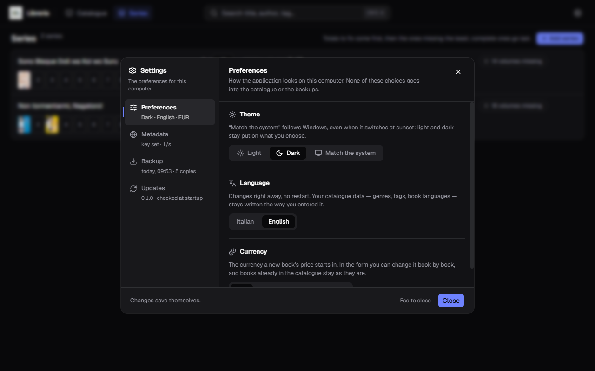
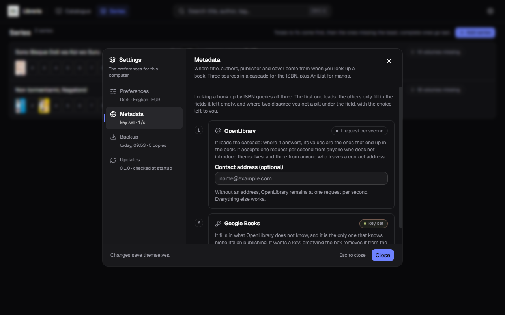
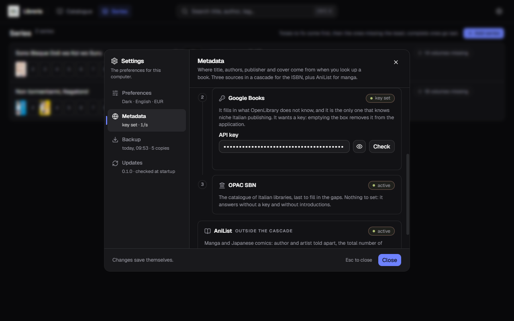
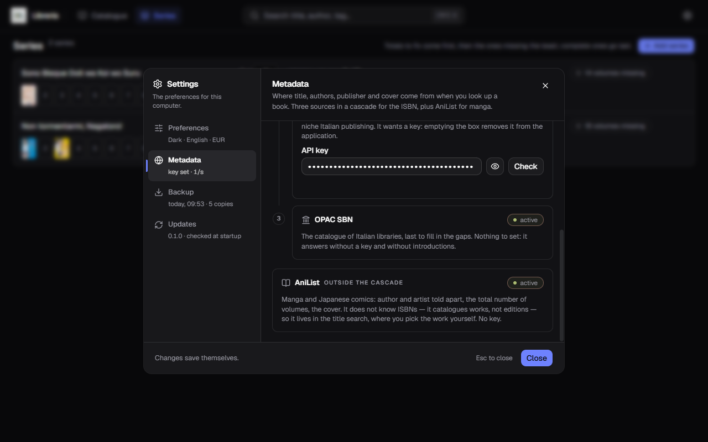

[Italiano](../it/Impostazioni.md) · **English**

# Settings

The gear top right. Four sections on a rail down the left.

**Changes save themselves**, with no Save button. The confirmation is not a word:
it is the line under each rail entry, summing up the state right now —
`Dark · English · EUR`, `key set · 1/s`, `today, 12:41 · 4 copies`,
`0.1.0 · checked at startup` — and it rewrites itself the moment you change
something, even from another section.

## Preferences

**Theme** — Light, Dark, or **Match the system**, which follows Windows even when
it switches at sunset. Light and dark, in contrast, stay put.

**Language** — Italian or English. Changes right away, no restart, and it covers
error messages too. What does **not** change is the data you typed: genres, tags,
shelves and book languages stay written the way you entered them.

**Currency** — EUR, USD, GBP, CHF, JPY. This is the currency a new book **starts
in**: in the form you change it book by book, and books already catalogued stay
as they are.

None of these choices goes into the catalogue or the backups: they live in a
separate file, on this computer.

## Metadata

The sources in cascade order, numbered.

### 1 · OpenLibrary

Leads the cascade: where it answers, its values are the ones that end up in the
book.

There is a single box, **Contact address**, and it is optional. OpenLibrary
accepts **one request per second** from anyone who does not introduce themselves
and **three** from anyone leaving an address. Without it everything still works,
just slower.

### 2 · Google Books

Fills in what OpenLibrary does not know, and it is **the only one that knows
niche Italian publishing**. It wants an API key, free from the Google Cloud
Console.

- the key goes in the box and stays **masked**; the eye reveals it;
- **Verify** tries it out and says straight away whether it works;
- **clearing the box removes the key** from the application. With no key, Google
  Books is simply skipped.

The free quotas are 1,000 requests a day and 100 a minute, and looking up a book
spends **one**: cataloguing by hand you will not reach them.

### 3 · OPAC SBN

The Italian library catalogue, last to fill the gaps. **Nothing to set**: it
answers with no key and no introductions.

### AniList — outside the cascade

Manga and Japanese comics. It does not know ISBNs, so it stays out of the cascade
and only shows up in the search by title. No key, no settings.

## Backup

Everything here is told in full in [Backup and restore](Backup-and-restore.md). In
short:

- **the folder** the files end up in, changeable with Browse;
- **Back up now**, **Open folder**, **Export to CSV**;
- the **Restore** block, ringed in red because it replaces everything.

## Updates

The installed version, a button to **check right now** for a newer one, and the
**Check for updates at startup** box, which you can untick.

If something new is out you get its number, its date and its notes, with the
button that takes you to the page to download from. **Nothing is downloaded and
nothing installs itself**: why, and what the notice's three buttons do, is in
[Updates](Updates.md).

## Where these settings live

In `impostazioni.json`, in the data folder, **outside the database and outside
the backups**.

That is not a detail: a restored archive does not bring you another computer's
theme, API key and camera. These are *this* machine's preferences, and they stay
put even after a restore.
