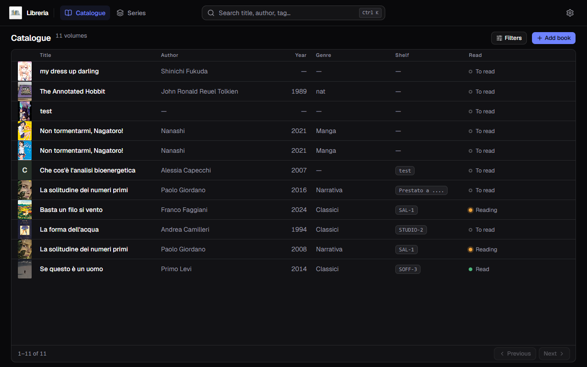
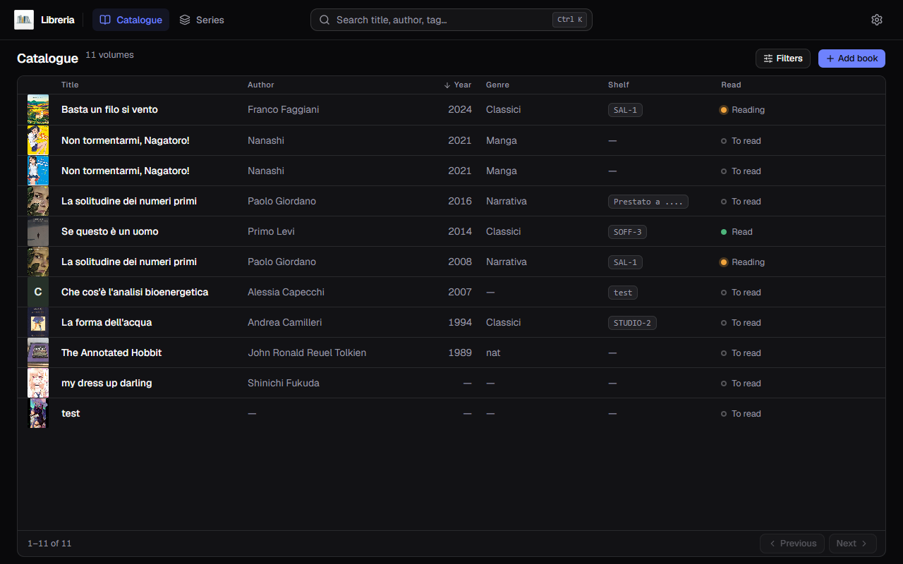
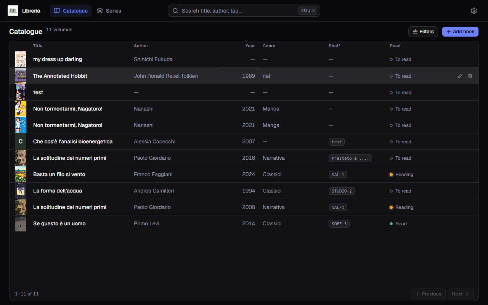
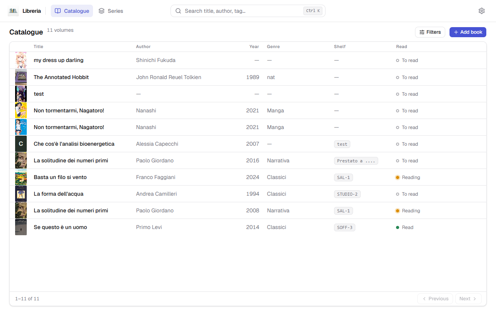

[Italiano](../it/Il-catalogo.md) · **English**

# The catalogue

This is the screen that opens on startup: one row per volume, seven columns.

Top left, the count tells you how many books you are looking at — `11 volumes`
when nothing is active, `3 results` once a search or a filter has narrowed
things down.

## The columns

| Column | What it shows |
|---|---|
| Cover | the thumbnail, or a spine drawn in the publisher's colour |
| Title | in bold |
| Author | every author of the book, comma separated |
| Year | the year of **this** edition, not of the first one |
| Genre | just one, the one you typed in the form |
| Shelf | where the book physically is: `SAL-1`, `STUDIO-2`, `Lent to…` |
| Read | `To read`, `Reading`, `Read`, with a coloured dot |

A dash `—` means the field is empty: not an error, just a field you have not
filled in.

## Sorting

Click a column header to sort. **Six columns out of seven are sortable** — all
but the cover.

Each header cycles through **three states**: first click ascending, second
descending, third back to the original order.

## Editing and deleting

Hover a row: two icons appear on the right.

- **the pencil** reopens the book in the form, with every field already filled;
- **the bin** deletes it, after a confirmation. The cover goes with it.

Deleting **cannot be undone**. If you get it wrong, the way back is
[restoring a backup](Backup-and-restore.md) — which brings back the *whole*
catalogue, though, not just that book.

## Paging

When the books run past one page, **Previous** and **Next** appear at the bottom
of the window, with the count on the left (`1–11 of 11`).

The footer stays **pinned to the bottom of the window** whether you have ten
books or two hundred: only the table scrolls, and the column headers stay in
view while it does.

## The light theme

Everything here exists in light too — you switch from [Settings](Settings.md).

