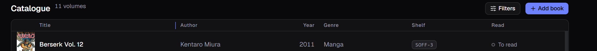

[Italiano](../it/Il-catalogo.md) · **English**

# The catalogue

This is the screen that opens on startup: one row per volume, seven columns.

Top left, the count tells you how many books you are looking at — `11 volumes`
when nothing is active, `3 results` once a search or a filter has narrowed
things down.

## The columns

| Column | What it shows |
|---|---|
| Cover | the thumbnail, or a spine drawn in the publisher's colour |
| Title | in bold, with the **subtitle** below it in small, where there is one |
| Author | every author of the book, comma separated |
| Year | the year of **this** edition, not of the first one |
| Genre | just one, the one you typed in the form |
| Shelf | where the book physically is: `SAL-1`, `Libreria-Camera`, `Lent to…` |
| Read | `To read`, `Reading`, `Read`, with a coloured dot |

A dash `—` means the field is empty: not an error, just a field you have not
filled in. Books with no subtitle do not leave an empty line: every row is the
same height, and the title centres itself.

**If a column cuts something off, rest the pointer on it.** After a moment the
whole value appears — the title with its subtitle, the author, the year, the
genre, the shelf — with no need to widen the column. On the cover you get the
title of the book, which is written nowhere there. The exception is **Read**,
which already has its word on screen.

## Resizing the columns

The right edge of **Title**, **Author** and **Genre** can be dragged: hover it
and the pointer turns into a double arrow, with a thin vertical line showing up.

Whatever one column takes, the ones to its right give up, so the table **always
fills the card** and there is never anything to scroll sideways. No column goes
below a minimum width: once there, the others stop giving and the handle goes no
further.

It works **from the keyboard** too: `Tab` after the header moves the focus onto
the handle, and `←` and `→` move it one step at a time.

**Year and Read stay narrow and cannot be resized.** They take the minimum their
header and their longest word (`To read`) need, and they carry no handle: they
are two short fields, and the room they save goes to the titles, which are not
short. The same holds for the cover and for the two icons at the end.

The width you choose **survives a restart**. It does not go into backups: it is a
preference of this window, not a piece of the catalogue.

## Sorting

Click a column header to sort. **Six columns out of seven are sortable** — all
but the cover.

Each header cycles through **three states**: first click ascending, second
descending, third back to the original order.

**By title the order follows the numbers, not the digits.** `Vol. 2` comes
before `Vol. 10`, instead of landing between `Vol. 1` and `Vol. 19` the way an
alphabetical order would put it. It does one thing only, and it is the one that
counts when you catalogue a series: the run of volumes reads in the order you
read them. Leading zeroes change nothing — `Vol. 007` still comes before
`Vol. 8`.

On the other columns the order is alphabetical and case does not count, while
accented letters go last.

## Editing and deleting

Hover a row: two icons appear on the right.

- **the pencil** reopens the book in the form, with every field already filled;
- **the bin** deletes it, after a confirmation. The cover goes with it.

Deleting **cannot be undone**. If you get it wrong, the way back is
[restoring a backup](Backup-and-restore.md) — which brings back the *whole*
catalogue, though, not just that book.

## Paging

When the books run past one page, **Previous** and **Next** appear at the bottom
of the window, with the count on the left (`1–11 of 11`).

The footer stays **pinned to the bottom of the window** whether you have ten
books or two hundred: only the table scrolls, and the column headers stay in
view while it does.

## The light theme

Everything here exists in light too — you switch from [Settings](Settings.md).

