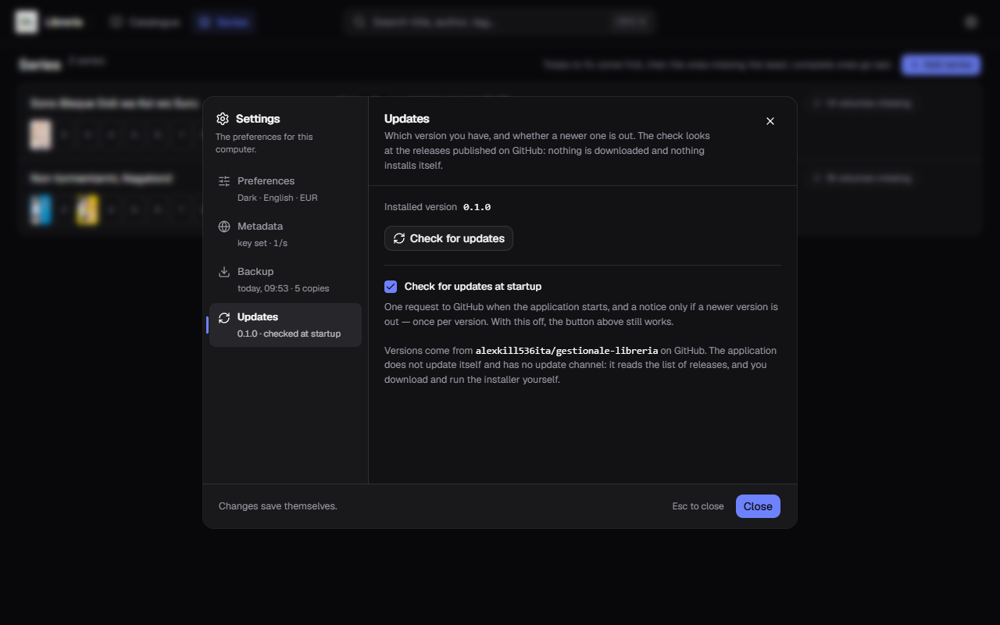

[Italiano](../it/Aggiornamenti.md) · **English**

# Updates

At startup the application checks whether a newer version is out. If there is
one, it says so; if there is not, it says nothing and you never notice.

**It downloads nothing and installs nothing by itself.** All it does is read the
list of published versions and show you what changed: you download and run the
installer yourself, whenever you feel like it.

## The notice at startup

When a new version is out, a panel appears on opening telling you **which version
is out**, **which one you have**, when it was published and the **release notes**
written by whoever published it. If the list is long, it scrolls.

Three ways out, and none of them installs anything:

| | |
|---|---|
| **Update now** | opens the release page in your browser, where the `.exe` is waiting to be downloaded |
| **Later** | closes and does nothing: it will remind you at the next startup |
| **Skip this version** | sets it aside. It will not come up again, until another one is out |

“Skip this version” is not final: that version stays downloadable from Settings,
which reminds you that you put it aside.

**Pressing “Update now” does not update anything on its own.** It only opens the
page: once the file is downloaded, installing is what
[Installation](Installation.md) describes — you install over the top, and your
data stays where it is.

## Checking right now

**Settings → Updates**, the fourth compartment of the rail. There you find:

- the **installed version**, the one currently running;
- **Check for updates**, which asks straight away instead of waiting for the next
  startup;
- if a new version is out, its number, its date and its notes, with the **Go to
  the release page** button.

The line under the **Updates** entry in the rail sums up the situation without
opening the compartment: `0.1.0 · checked at startup` when all is quiet,
`0.1.0 · 0.2.0 available` when there is something to download.

## Turning the check off

The **Check for updates at startup** box can be unticked. With it off the notice
never appears and the application contacts nobody at startup: the **Check for
updates** button stays, for whenever you want it.

With it on, the check costs **one request** when the program opens, and the notice
appears **once per version** — not at every startup.

## What travels over the network

One request to GitHub, asking for the list of published versions of this program.
**It sends nothing of yours**: not your books, not how many, not an identifier.
There is no account, there is no telemetry, and the answer is the same for
anybody who asks for it.

If you are offline the check fails and **it does not tell you**: you did not ask
for anything, and a startup warning about something you did not ask for would be
noise. Press **Check for updates**, though, and you do get an answer — because
there you asked.

## The messages you may see

**“No version of … has been published on GitHub yet”** — not a fault: it means no
version has been published publicly yet, and the one you have is the only one
there is.

**“GitHub cannot be reached…”** — either the connection is missing, or GitHub is
unreachable from here. Your catalogue is untouched: try again later.

**“GitHub answered with an error (HTTP …)”** — the problem is on the other end and
goes away on its own. Try again in a few minutes.

**“… cannot be opened in the browser”** — the address is in the message: copy it
into the address bar by hand.

## Why it does not update itself

An automatic update is a channel through which code arrives from the outside and
your computer runs it. Keeping such a channel safe means signing every version
with a key and publishing it alongside the file: continuous work and attention,
for a program you install yourself, on a single computer.

The choice was to stop at the notice. That way **no outside program can get
itself installed in place of the update**, because there is nothing that
installs. What comes in is the text of a list of versions; the only thing that
opens is a browser page.
