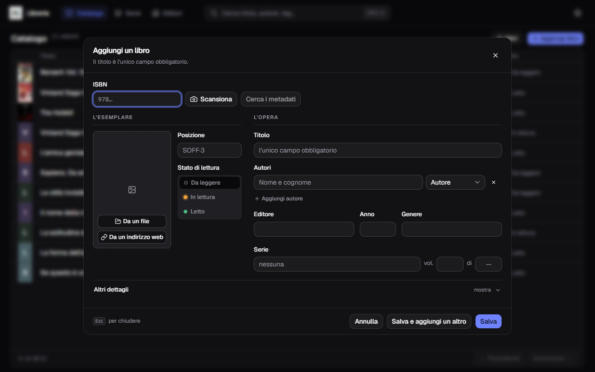
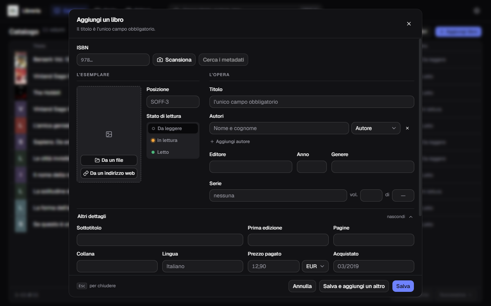
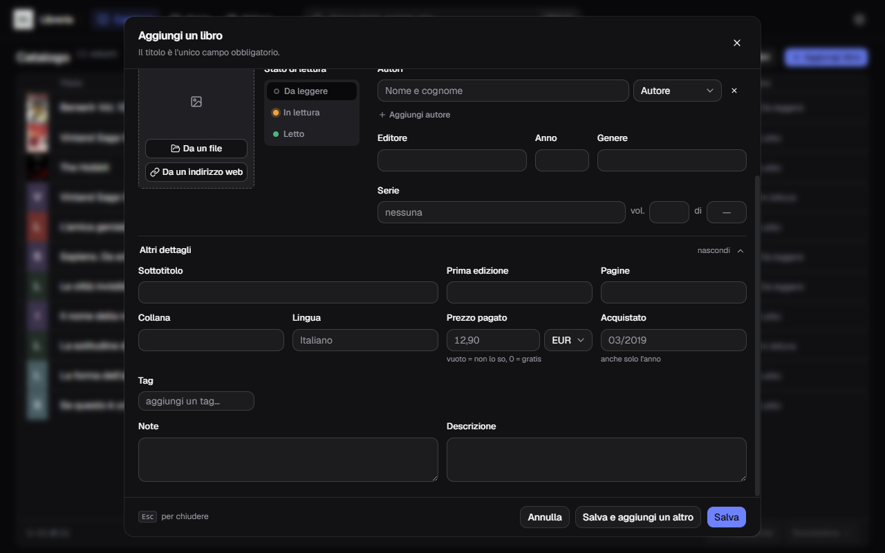
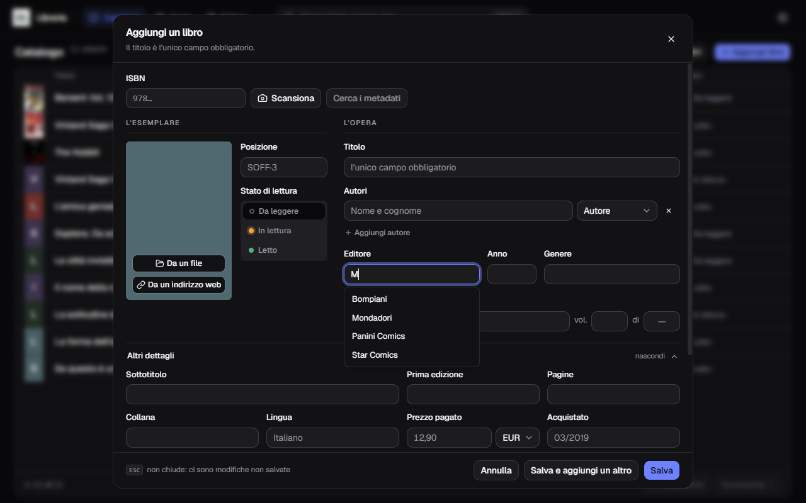
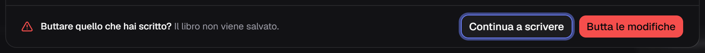
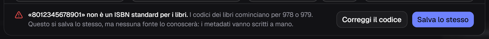
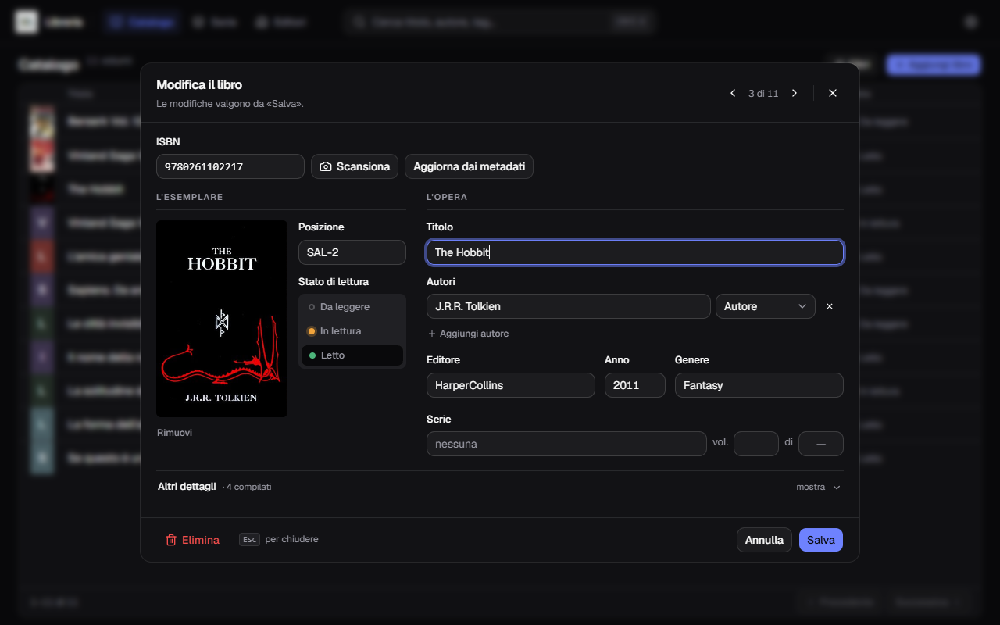
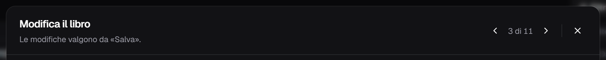

**Italiano** · [English](../en/Adding-a-book.md)

# Aggiungere e modificare un libro

Il pulsante **Aggiungi libro** sta in alto a destra nel catalogo. Lo stesso
modulo si riapre con la matita su una riga, per modificare.

**Il titolo è l'unico campo obbligatorio.** Tutto il resto può restare vuoto.

## Come è diviso

Il modulo ha due colonne, e la divisione non è estetica:

- **L'esemplare** — la copia che hai in mano. Dove sta sullo scaffale, se l'hai
  letta, quanto l'hai pagata, la sua copertina.
- **L'opera** — il libro come lo conosce il mondo. Titolo, autori, editore,
  anno, serie.

Sopra le due colonne sta l'**ISBN** con i due pulsanti che fanno il lavoro al
posto tuo: **Scansiona** (accende la webcam) e **Cerca i metadati**.

## I dieci campi sempre visibili

| Campo | Note |
|---|---|
| ISBN | 10 o 13 cifre; è la chiave con cui si cercano i metadati |
| Posizione | testo libero: `SAL-1`, `Comodino`, `Prestato a Marco` |
| Stato di lettura | Da leggere · In lettura · Letto |
| Titolo | **obbligatorio** |
| Autori | uno o più, ognuno con un ruolo (Autore, Disegnatore, Traduttore…) |
| Editore | |
| Anno | di questa edizione |
| Genere | uno solo |
| Serie | il nome, più il numero del volume |
| Volumi totali | quanti volumi ha la serie in tutto |

Per aggiungere un secondo autore c'è **+ Aggiungi autore**; la `×` a destra
toglie la riga.

## Altri dettagli

Dieci campi in più stanno sotto **Altri dettagli**, chiuso all'inizio. Si apre
da sé quando una ricerca dei metadati ha riempito qualcosa là sotto — e
l'etichetta dice quanti campi sono stati compilati (`· 4 compilati`), così sai
che vale la pena guardare.

Sottotitolo, anno della prima edizione, pagine, collana, lingua, prezzo pagato
con la valuta, quando l'hai comprato, i tag, le note e la descrizione.

Due caselle meritano una riga:

- **Prezzo pagato** — vuoto vuol dire «non lo so», `0` vuol dire «gratis»: sono
  due cose diverse e restano distinte. La valuta si sceglie accanto, libro per
  libro; quale sia quella predefinita si decide nelle [Impostazioni](Impostazioni.md).
- **Acquistato** — va bene anche solo l'anno.

## I suggerimenti mentre scrivi

Sette campi ti propongono quello che hai già usato: posizione, genere, editore,
collana, lingua, serie e tag. Basta la prima lettera.

Non è solo comodità. Se scrivi `Manga` in un libro e `manga` in un altro, ti
ritrovi **due generi** che si dividono i conteggi nei filtri. Accettando il
suggerimento resti sulla grafia che hai già scelto.

## Entrare in una serie riempie qualche casella

Scrivi nel campo **Serie** il nome di una serie che hai già, e il modulo si
riempie da sé di quello che quella serie ha imparato dagli altri volumi: **tag,
genere, editore e collana**. I tag si aggiungono ai tuoi, i tre campi singoli
entrano **solo dove erano vuoti** — quello che hai scritto tu resta com'è. Se
qualcosa è finito sotto **Altri dettagli**, il pannello si apre da sé.

Anche i **volumi totali** arrivano da lì, se la serie ne ha uno e tu non ne hai
già scritto uno tuo.

Come una serie impara quei valori, e come si correggono per tutti i volumi in un
colpo, sta in [Le serie](Le-serie.md).

## Salvare

Tre pulsanti in fondo:

- **Salva** — salva e chiude;
- **Salva e aggiungi un altro** — salva e ripulisce il modulo restando aperto,
  con la webcam ancora accesa se stavi scansionando. È il modo di catalogare una
  pila di libri uno dietro l'altro;
- **Annulla** — chiude senza salvare.

Se hai scritto qualcosa, `Esc` e **Annulla** non chiudono subito: chiedono
conferma.

## Un codice che non è un ISBN

I codici dei libri cominciano per `978` o `979`. Se ne scrivi uno di tredici
cifre che non è di quella famiglia — o un `978` con l'ultima cifra che non torna
— **il salvataggio non si blocca: ti fa una domanda.** In fondo al modulo compare
il codice per intero, la riga che dice che nessuna fonte lo conoscerà, e due
strade:

- **Correggi il codice** — riporta il fuoco sulla casella dell'ISBN;
- **Salva lo stesso** — lo scrive nel catalogo così com'è. I metadati di quel
  libro andranno riempiti a mano: quel codice non lo cerca nessuno.

Confermato una volta, non te lo richiede a ogni modifica di quel libro. Ma basta
che tu **tocchi il campo ISBN** perché torni a chiedere, e va bene così: un
codice storto scritto dopo una conferma non deve passare in silenzio.

Sotto le tredici cifre invece è un rifiuto, non una domanda — `97888` non è un
codice da salvare lo stesso, è un codice sbagliato.

## Modificare un libro che c'è già

La matita nel catalogo riapre lo stesso modulo con i campi pieni. Tre
differenze:

- il pulsante della ricerca si chiama **Aggiorna dai metadati**, e quello che
  trova non scrive sopra quello che hai: compare come pastiglie accanto ai tuoi
  valori, e decidi campo per campo;
- **quello che svuoti viene cancellato davvero.** Non resta il valore di prima:
  la casella vuota vince;
- **l'unica eccezione sono i volumi totali della serie.** Svuotare quella casella
  non azzera il totale, perché quel numero appartiene alla serie e non a questa
  copia: azzerarlo salvando *un* volume lo toglierebbe a tutti gli altri. Per
  togliere davvero un totale si passa da [Le serie](Le-serie.md).

**Elimina** sta in basso a sinistra, lontano da Salva.

## Passare da un libro all'altro senza chiudere

In modifica la testata porta due frecce e dice a che punto sei: `3 di 11`.

Servono quando stai sistemando una serie intera: apri il primo volume, correggi,
freccia, correggi il secondo. Funzionano anche con `Alt`+`←` e `Alt`+`→`.

Tre cose che vale la pena sapere:

- **il conto è quello del catalogo come lo stai guardando** — con la ricerca e i
  filtri che hai attivi, e nell'ordine che hai scelto. Se hai filtrato per una
  posizione, scorri solo quei libri;
- **la pagina non ti ferma.** Arrivato all'ultimo libro della pagina, la freccia
  apre il primo della successiva e la tabella sotto volta pagina con te;
- **se hai scritto qualcosa e non l'hai salvato, la freccia chiede prima** — la
  stessa domanda di `Esc`. «Continua a scrivere» ti lascia dove sei.

Sul primo libro la freccia indietro è spenta, e sull'ultimo quella avanti.
