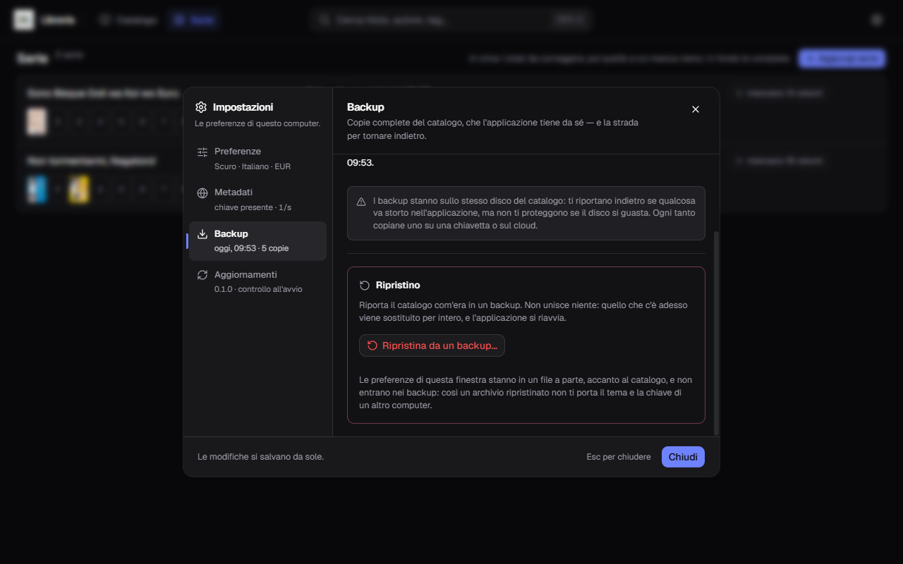

**Italiano** · [English](../en/Backup-and-restore.md)

# Backup, esportazione e ripristino

Tutto in **Impostazioni → Backup**.


## I backup automatici

Uno **all'avvio**, poi **una volta al giorno**. Restano le **ultime sette
copie**: la più vecchia se ne va da sé, quindi la cartella non cresce
all'infinito.

Ogni copia è un file `.zip` con dentro il catalogo **e le copertine**, chiamato
per data:

```
libreria-2026-08-31.zip
```

**Crea backup adesso** ne fa uno subito, senza aspettare domani — utile prima di
un'importazione grossa o di una ripulita.

**Apri cartella** apre Esplora risorse dove sono i file.

Se un backup fallisce, in cima alla finestra compare un avviso che **non si
chiude da solo**: è l'unico modo perché tu te ne accorga.

### Dove finiscono

Di partenza in `%LOCALAPPDATA%\it.alexkill536ita.gestionale-libreria\backups\`.
Con **Sfoglia** si sceglie un'altra cartella — una chiavetta, una cartella
sincronizzata sul cloud.

E qui va detta la cosa importante:

> **I backup stanno sullo stesso disco del catalogo.** Ti riportano indietro se
> qualcosa va storto nell'applicazione, ma **non ti proteggono se il disco si
> guasta.** Ogni tanto copiane uno su una chiavetta o sul cloud.

Le impostazioni **non entrano** nei backup: tema, lingua, chiave API e
fotocamera restano di questo computer.

## Esportare in CSV

**Esporta in CSV** scrive un file di testo con **ventidue colonne**, una riga
per libro:

```
id;titolo;sottotitolo;autori;editore;collana;anno;anno prima edizione;
genere;tag;serie;volume;isbn;lingua;pagine;prezzo;valuta;acquistato;
posizione;stato di lettura;note;aggiunto il
```

Il file è pensato per **aprirsi bene in Excel italiano**: separatore `;`,
codifica UTF-8 con BOM, prezzo con la virgola decimale (`980,00`). Doppio clic e
si apre già in colonne, con gli accenti al loro posto.

Le intestazioni restano in italiano anche con l'applicazione in inglese: è un
formato di scambio, e un file che cambia intestazione con la lingua non si apre
due volte allo stesso modo.

**Il CSV non è un backup.** Non contiene le copertine e non si può ripristinare:
serve per portare i dati altrove — un foglio di calcolo, un'altra applicazione,
una stampa.

## Ripristinare



**Ripristina da un backup…** riporta il catalogo com'era in un archivio.

**Non unisce niente.** Quello che c'è adesso viene **sostituito per intero**: i
libri aggiunti dopo quel backup spariscono, con le loro note, i prezzi e le
posizioni.

Come va:

1. scegli il file `.zip`;
2. l'applicazione lo **legge e lo controlla** prima di toccare qualsiasi cosa, e
   la conferma nomina il file e i due conteggi — quanti libri hai adesso e
   quanti ne ha l'archivio;
3. se confermi, **prima di cominciare salva un backup dello stato attuale**: se
   hai scelto l'archivio sbagliato, si torna indietro;
4. il catalogo viene sostituito e **l'applicazione si riavvia da sola**.

Il riavvio non è un capriccio: il catalogo è aperto mentre lo usi, e sostituirlo
a caldo lo corromperebbe. La sostituzione vera avviene al riavvio successivo,
prima che qualcuno lo apra.

Un archivio danneggiato, o che non contiene un catalogo valido, **viene
rifiutato** in fase di lettura: il catalogo di adesso non viene toccato.

## Se il computer si rompe

Sul computer nuovo:

1. [installa l'applicazione](Installazione.md) e aprila una volta;
2. Impostazioni → Backup → **Ripristina da un backup…**;
3. scegli lo `.zip` che avevi messo da parte.

Tornano libri e copertine. **Non** tornano tema, lingua, valuta, chiave API e
fotocamera: quelle si rimettono a mano in un minuto.
