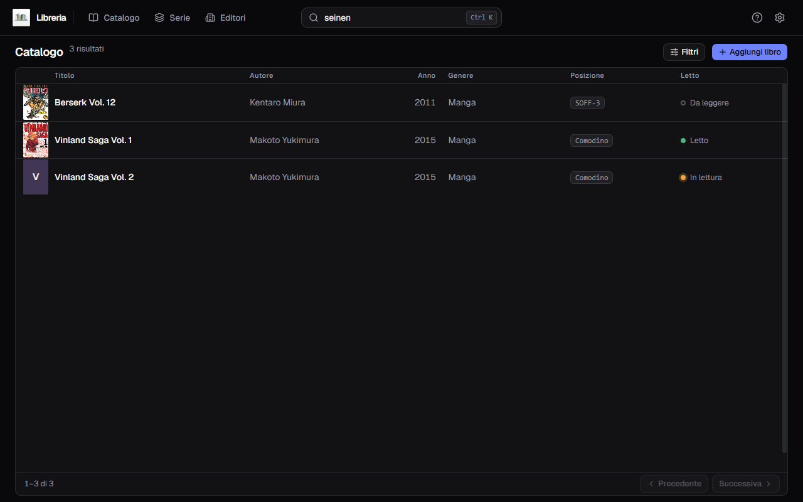
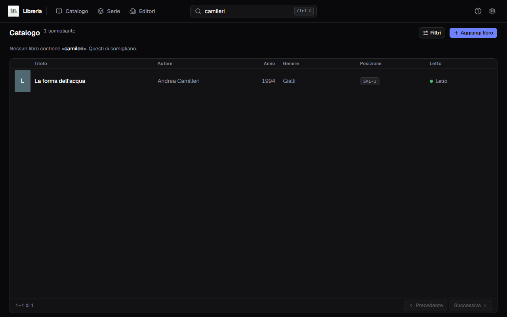
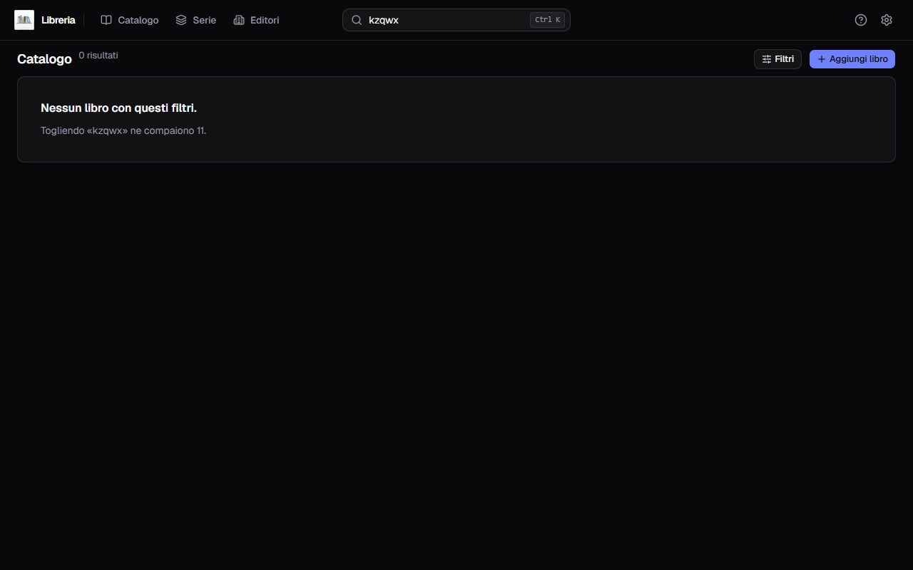
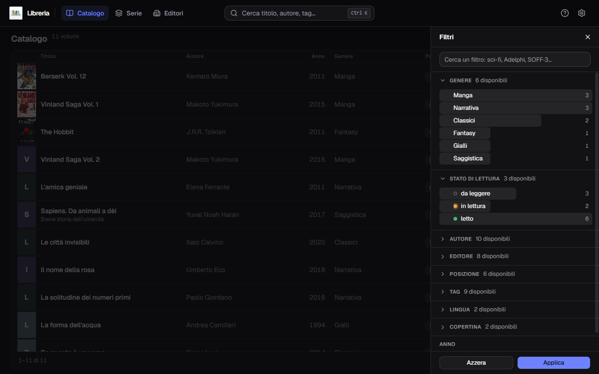
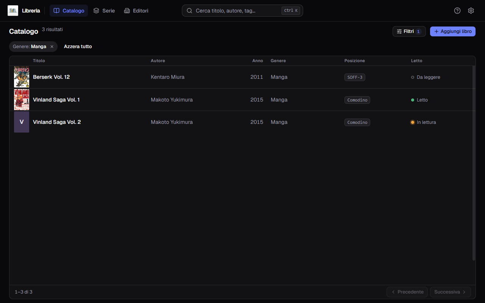

**Italiano** · [English](../en/Search-and-filters.md)

# Cercare e filtrare

Due strumenti distinti: la **barra in alto** cerca nel testo, il **pannello
Filtri** restringe per faccetta. Si sommano.

## La barra di ricerca

Al centro della barra, sempre presente. Cerca mentre scrivi, senza premere
`Invio`. `Ctrl K` ci porta il cursore da qualunque punto.

Guarda dentro **titolo, sottotitolo, autori, tag, editore, collana e note**. Non
serve la parola intera: bastano le prime due o tre lettere.

Restano fuori la descrizione e il nome della serie: per le serie c'è
[la pagina apposta](Le-serie.md).

### Quando sbagli a scrivere

Se la ricerca esatta non trova niente e hai scritto almeno tre caratteri, parte
un secondo giro che **perdona un errore di battitura** e mostra i libri che
somigliano, dicendolo sopra la tabella.

`camileri` non esiste in nessun libro, ma *«Nessun libro contiene «camileri».
Questi ci somigliano»* e sotto compare Camilleri.

### Quando davvero non c'è niente

Il messaggio dice sempre **cosa togliere** per rivedere qualcosa: qui *«Togliendo
«kzqwx» ne compaiono 11»*.

## Il pannello dei filtri

Il pulsante **Filtri** apre un pannello a destra.

Nove modi di restringere:

| | |
|---|---|
| **Genere** | con il conteggio dei libri accanto a ciascuno |
| **Stato di lettura** | da leggere · in lettura · letto, anche questi contati |
| **Autore** | |
| **Editore** | |
| **Posizione** | dove sta il libro |
| **Tag** | |
| **Lingua** | |
| **Copertina** | con o senza |
| **Anno** | un intervallo, `da` e `a` |

In cima c'è una casella per **cercare un filtro**, che serve quando i tag sono
ventinove e scorrerli è più lento che scriverne tre lettere.

Le sezioni oltre le prime due sono chiuse: un clic sulla riga le apre. Il numero
accanto al titolo (`AUTORE 10 disponibili`) dice quanti valori ci sono da
scegliere.

**Applica** chiude il pannello e filtra; **Azzera** toglie tutto.

I conteggi non sono decorativi: dicono in anticipo quanti libri resteranno, così
non applichi un filtro per scoprire che porta a zero.

## I chip

I filtri attivi restano in vista sotto il titolo, uno per chip.

La `×` su un chip toglie quel filtro solo; **Azzera tutto** li toglie tutti. Il
pulsante Filtri porta un contatore, così sai quanti ne hai lasciati attivi anche
a pannello chiuso.

**Un chip arriva anche da fuori.** Il nome di una serie in [**Le
serie**](Le-serie.md), e una card del carosello in [**Gli
editori**](Gli-editori.md), aprono il catalogo già filtrato: il chip `Serie:` è
lì che dice perché stai vedendo quei libri, e si toglie come tutti gli altri.

## Ricerca e filtri insieme

Si sommano: la ricerca cerca dentro i libri che i filtri hanno lasciato passare.
Quando trovi zero risultati con un filtro attivo, il messaggio parla della
**ricerca ristretta**, non del catalogo intero — e ti dice quale togliere.

## Maiuscole e accenti

Non contano. `citta studi`, `Città Studi` e `CITTÀ STUDI` trovano le stesse cose.
Vale sia nella barra sia nei filtri.
