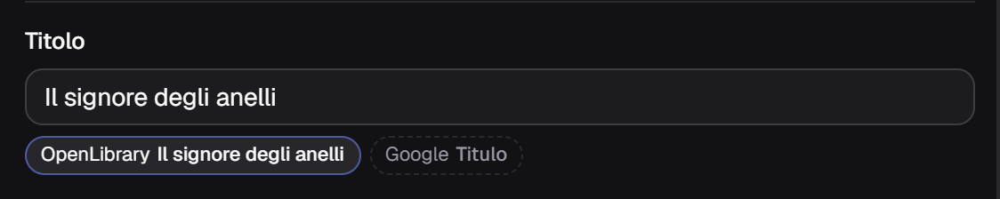
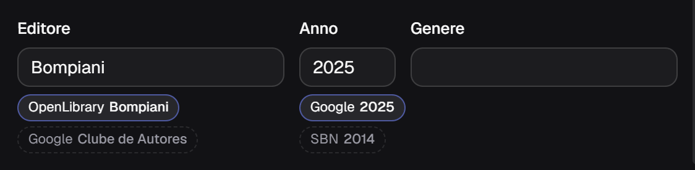
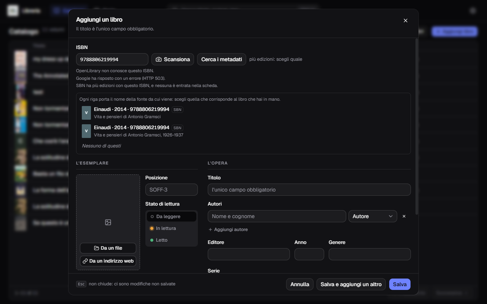
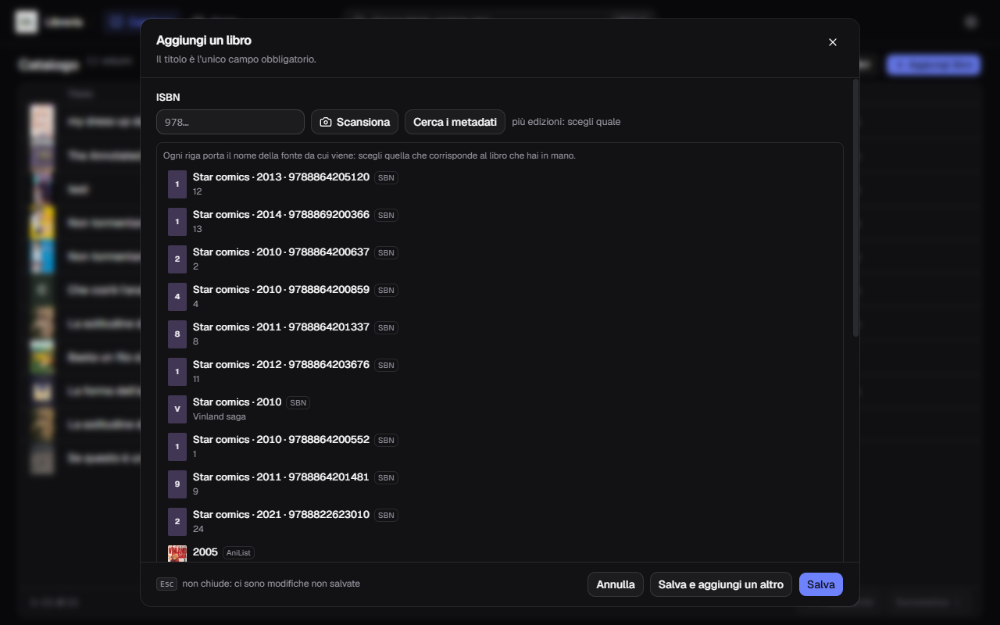
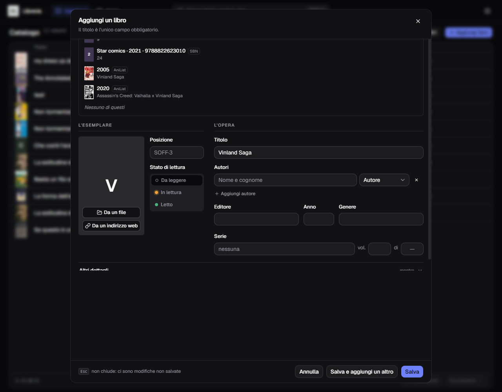

**Italiano** · [English](../en/Looking-up-metadata.md)

# Cercare i metadati

Un pulsante solo, **Cerca i metadati**, e decide da sé da dove partire:

- se c'è un **ISBN**, vince l'ISBN;
- altrimenti guarda **titolo e autori** e cerca per titolo.

È spento solo quando non c'è né l'uno né gli altri. `Invio` dentro il campo ISBN
fa la stessa cosa.

## Le quattro fonti

| | Fonte | Cosa dà |
|---|---|---|
| 1 | **OpenLibrary** | comanda la cascata, e porta anche la copertina |
| 2 | **Google Books** | l'unica che conosce l'editoria italiana di nicchia |
| 3 | **OPAC SBN** | il catalogo delle biblioteche italiane, ultimo a riempire i buchi |
| — | **AniList** | manga e fumetto giapponese, **fuori** dalla cascata |

Le prime tre si interrogano **tutte e tre insieme**, non una dopo l'altra.
Comanda la prima che risponde: le altre riempiono soltanto i campi che ha
lasciato vuoti.

AniList sta fuori perché **non conosce gli ISBN** — cataloga opere, non edizioni.
Compare solo nella ricerca per titolo, dove sei tu a scegliere la riga giusta.

## Quando le fonti non dicono la stessa cosa

Sotto il campo compare una **pastiglia** per ogni valore diverso, con il nome
della fonte da cui viene. Quella scelta ha il bordo acceso; le altre sono
tratteggiate. Un clic e prendi l'altra.

Qui il titolo lo dà OpenLibrary, e Google propone qualcosa di diverso: un clic
sulla pastiglia tratteggiata e prendi la sua.

Sull'editore OpenLibrary dice `Bompiani` e Google `Clube de Autores`; sull'anno
Google dice `2025` e SBN `2014`. Nessuna delle due ha ragione per definizione:
guardi il libro che hai in mano e scegli.

La scheda intera, dopo una ricerca riuscita:

La copertina è scesa da sola, e sotto ogni campo conteso c'è la sua pastiglia.

## Quando un ISBN ha più edizioni

Capita che una fonte conosca più edizioni con lo stesso ISBN e non sappia quale
sia la tua. Invece di indovinare, te le mette in fila.

Ogni riga porta editore, anno, ISBN e **il nome della fonte**. Scegli quella che
corrisponde al libro che hai in mano, oppure **Nessuno di questi** e compili a
mano.

Sopra la lista, in chiaro, c'è anche il resoconto di com'è andata con ciascuna
fonte: `OpenLibrary non conosce questo ISBN`, `Google ha risposto con un errore
(HTTP 503)`. Non sono guasti dell'applicazione: sono le risposte dei cataloghi.

## Cercare per titolo

Se l'ISBN non lo conosce nessuno — o se non ce l'hai — scrivi il titolo e premi
lo stesso pulsante. La ricerca per titolo parte anche da sola quando la cascata
per ISBN torna a mani vuote e nel modulo c'è già un titolo o un autore.

Le righe **SBN** portano editore, anno e l'ISBN dell'edizione italiana, con il
numero del volume a sinistra. Scorrendo in fondo alla lista si trovano quelle di
**AniList**, con la miniatura della copertina e l'anno dell'opera.

## Il manga da AniList

Scegliendo un'opera di AniList arrivano cose che nessuna delle altre tre dà:

- **la copertina**, scaricata subito;
- **autore e disegnatore distinti**, quando sono due persone diverse;
- **il nome della serie e il totale dei volumi** — qui `Vinland Saga`, `29`;
- **generi e tag**, in inglese, proposti sotto il campo Tag: clic su quelli che
  vuoi tenere;
- la descrizione, ripulita dall'HTML.

Quello che AniList **non** ha, e che resterà vuoto: editore, collana, pagine,
prezzo e anno dell'edizione italiana. Quelli li riempiono le altre fonti, o tu.

## Modificare un libro già catalogato

Se cerchi i metadati di un libro che è già nel catalogo, i valori trovati **non
ci scrivono sopra**: compaiono come pastiglie accanto a quelli che hai già, e
decidi campo per campo.

## Se non trova niente

Non tutte le fonti conoscono tutto. La saggistica italiana di piccoli editori e
certe edizioni di nicchia non stanno da nessuna parte: in quel caso il modulo si
compila a mano, che è come si è sempre fatto.

Per le impostazioni delle fonti — la chiave di Google Books, l'indirizzo di
contatto per OpenLibrary — vedi [Impostazioni](Impostazioni.md).
