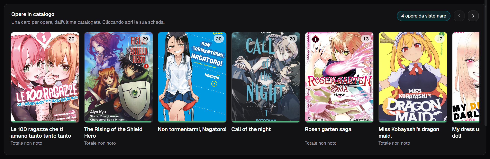
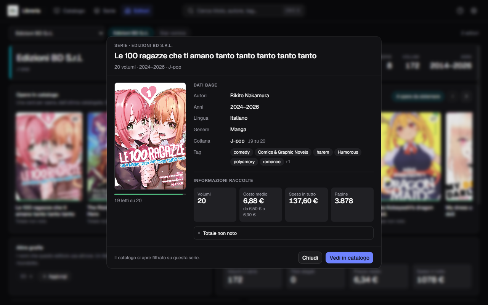
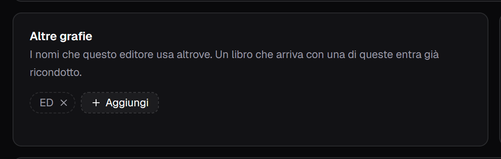
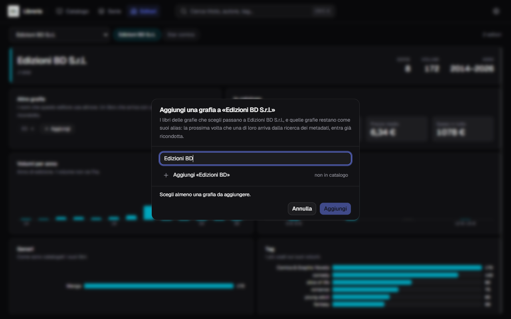
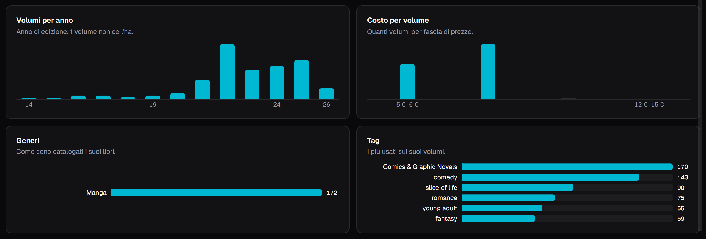

**Italiano** · [English](../en/Publishers.md)

# Gli editori

La voce **Editori** nella barra guarda il catalogo da un lato solo: **un editore
per volta**. Chi è, quanto pesa sui tuoi scaffali, e con quali nomi si presenta.

Un editore compare qui appena un libro del catalogo ne porta il nome. Non c'è
niente da preparare prima.

## Scegliere di chi parlare

In alto a sinistra la tendina con tutti gli editori, e accanto le pastiglie dei
**cinque più grandi**, per non doverli cercare. A destra il conto di quanti sono.

Sotto, la scheda: il nome, le **collane** che pubblica, e a destra tre numeri —
quante **serie**, quanti **volumi**, e l'**arco degli anni** delle edizioni che
hai. Ogni editore ha una tinta sua, presa dal suo nome, e i suoi grafici la
portano.

## Le opere in catalogo

Sotto la scheda, la fascia delle sue **opere**: una card per opera, non per
volume.

Una **serie** sta per tutti i suoi volumi: mostra la copertina del **primo**, il
titolo dell'opera, e in alto a destra la pastiglia con **quanti ne hai**. Un
**titolo slegato** sta per sé e quella pastiglia non ce l'ha: è così che si
distinguono, senza una parola in più. Il filo al piede della copertina dice
quanti volumi hai letto.

L'ordine è quello dell'**ultimo volume catalogato**: in testa c'è quello che hai
appena messo dentro, e la card di una serie ci risale ogni volta che le aggiungi
un volume. Non è l'ordine in cui hai scoperto l'editore, è «cosa ho catalogato
di recente».

**Una card tace quando la serie è a posto**, e parla in una riga sola quando non
lo è:

| | |
|---|---|
| *Mancano 4 volumi* | il totale della serie è noto e non ci sei ancora |
| *Totale non noto* | nessuno ha detto quanti volumi sono in tutto |
| *Il totale della serie dice 15* | ne hai catalogati più di quanti la serie dichiara |
| *Titolo unico* | non è una serie |

Le prime tre sono anche il conto della pastiglia in alto a destra — *«5 opere da
sistemare»* — che è l'unico posto della fascia dove entra la tinta
dell'editore. Un totale sbagliato o mancante si corregge da [**Le
serie**](Le-serie.md).

**Cliccando una card si apre la scheda dell'opera**: la copertina, i dati base —
autori con il loro ruolo, anni, lingua, genere, collana, tag — e le informazioni
raccolte, cioè quanti volumi hai, quanto ti sono costati in media e in tutto,
quante pagine, e a che punto sta la serie.

Su una serie i valori sono **la somma dei suoi volumi di questo editore**, e
dove i volumi non dicono la stessa cosa la scheda lo scrive accanto: *«Italiano
15 su 16»* vuol dire che quindici volumi su sedici sono in italiano, non che la
serie lo sia. Dove il conto non compare, vuol dire che valgono tutti.

Il catalogo filtrato non è sparito: è il **Vedi in catalogo** in fondo alla
scheda, un clic più in là, dove ci arrivi dopo aver visto i numeri.

Le frecce in alto a destra compaiono **solo se c'è davvero da scorrere**: con
poche opere non c'è nessun comando spento a occupare posto. La fascia scorre
anche con la rotella e con il `Tab`.

## Le altre grafie

È la parte che conta, e non è una scorciatoia estetica.

Lo stesso editore arriva dalle fonti dei metadati con nomi diversi — `Einaudi` da
una, `Giulio Einaudi Editore` da un'altra — e nessun confronto fra parole li
unirà mai. Il risultato è una faccetta dei filtri sdoppiata, con metà dei libri
per parte.

Il pannello **Altre grafie** elenca i nomi che quell'editore usa altrove. La
riga sotto il titolo dice a cosa servono: *«Un libro che arriva con una di queste
entra già ricondotto»*.

**Un alias non è la cronologia di una fusione fatta una volta: è una regola su
quello che entrerà domani.** I libri che avevi sono già passati al nome buono; la
regola serve perché la prossima ricerca dei metadati non riporti dentro la grafia
sbagliata.

## Aggiungere una grafia

La pastiglia **+ Aggiungi**, in fondo alla fila, apre il dialogo. Il bersaglio è
sempre l'editore che stai guardando.

La casella fa **due cose**:

- **cerca** fra le grafie che il catalogo ha già, e le spunti;
- **scrive**. Se il nome che vuoi registrare non ce l'ha ancora nessun libro,
  scrivilo per intero: compare in cima come *«Aggiungi «…»»* e `Invio` lo
  aggiunge alle scelte.

La seconda è quella che serve più spesso, ed è il motivo per cui questa non è una
lista chiusa: la grafia doppia la porta la **cascata dei metadati**, e la regola
va registrata **prima** che quel nome arrivi.

La riga in fondo dice sempre cosa succederà: *«12 libri passano a Edizioni BD
S.r.l.»*, oppure *«Nessun libro cambia: resta la regola per quello che
arriverà»*. Il pulsante si chiama **Aggiungi** dall'inizio alla conferma.

La `×` accanto a una grafia la **dimentica**. Dimenticare un alias non riporta
indietro nessun libro: quelli hanno già il nome buono, e quello che si toglie
riguarda soltanto ciò che arriverà.

## In catalogo

Quattro numeri, che rispondono a «quanto pesa questo editore in casa mia»:

| | |
|---|---|
| **Volumi in serie** | quanti dei suoi volumi appartengono a una serie |
| **Titoli slegati** | quanti stanno da soli |
| **Prezzo medio** | per volume |
| **Speso in tutto** | la somma di quello che hai pagato |

I due che parlano di soldi guardano **una valuta sola**, quella che usi di più
con quell'editore. Se qualche volume ha un prezzo in un'altra, la pagina lo dice
e lo lascia fuori: sommare euro e yen darebbe un numero che non significa niente.

## I quattro grafici

| | |
|---|---|
| **Volumi per anno** | anno di **edizione**, non di acquisto; dice quanti volumi ce l'hanno |
| **Costo per volume** | quanti volumi per **fascia di prezzo** |
| **Generi** | come sono catalogati i suoi libri |
| **Tag** | i più usati sui suoi volumi |

Il costo è una **distribuzione a fasce, non una media**, e la differenza si vede:
un prezzo medio di 6,34 € non distingue chi stampa tutto a quel prezzo da chi
alterna tascabili e cofanetti.

Non c'è nessuna legenda, e il colore è uno solo: in un grafico ordinato la
lunghezza della barra dice già tutto. Sotto ogni grafico c'è la stessa
informazione in forma di tabella, per chi legge con uno screen reader.

## Perché la fusione tocca anche le serie

Quando una grafia confluisce in un'altra, cambia anche l'editore delle **serie**
che la portavano. Non è un dettaglio: l'editore di una serie è quello che la
serie *detta* ai volumi che le entrano, e lasciandolo vecchio la grafia appena
sistemata rientrerebbe dal primo volume catalogato.
