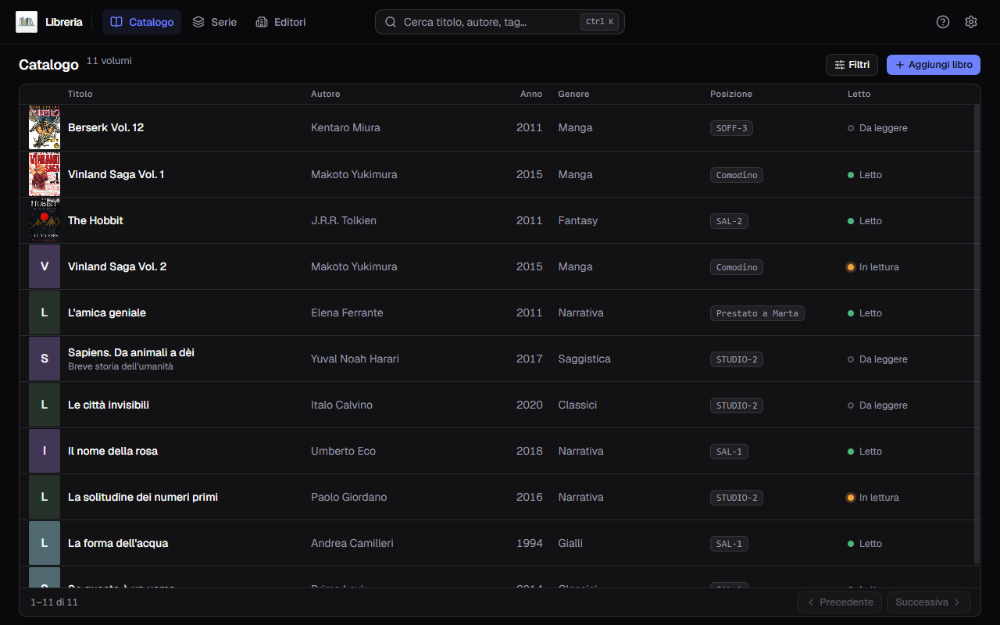

**Italiano** · [English](../en/Home.md)

# Gestionale Libreria

Catalogo personale di libri di carta per Windows. Sta su un computer solo, non
chiede un account e funziona senza rete — tranne quando vai a cercare i dati di
un libro, che arrivano da cinque cataloghi pubblici.

Da settembre 2026 ogni versione porta anche un file per **macOS**, che però
nessuno ha ancora aperto su un Mac: cosa aspettarsi sta in
[Installazione](Installazione.md).

## Che cosa sa fare

| | |
|---|---|
| **[Il catalogo](Il-catalogo.md)** | La tabella dei tuoi libri: ordinare, sfogliare, modificare, eliminare |
| **[Aggiungere un libro](Aggiungere-un-libro.md)** | Il modulo, i venti campi, cosa è obbligatorio (poco) |
| **[Cercare i metadati](Cercare-i-metadati.md)** | Un pulsante riempie la scheda da OpenLibrary, Google Books, SBN, NiceBooks e AniList |
| **[Le copertine](Le-copertine.md)** | Scendono da sole, oppure le metti tu da un file o da un indirizzo |
| **[Cercare e filtrare](Cercare-e-filtrare.md)** | La barra in alto, i nove filtri, il ripiego quando sbagli a scrivere |
| **[Le serie](Le-serie.md)** | Quali volumi ti mancano, e i valori che una serie passa ai suoi volumi |
| **[Gli editori](Gli-editori.md)** | Un editore per volta: le sue opere in un carosello, e la regola che tiene insieme i suoi nomi diversi |
| **[Scansionare il codice a barre](Scansionare-il-codice-a-barre.md)** | La webcam legge l'ISBN dalla quarta di copertina |
| **[Impostazioni](Impostazioni.md)** | Tema, lingua, valuta, le fonti dei metadati, la cartella dei backup |
| **[Backup e ripristino](Backup-e-ripristino.md)** | Una copia al giorno, l'esportazione in CSV, la strada per tornare indietro |
| **[Aggiornamenti](Aggiornamenti.md)** | Ti avvisa se esce una versione nuova, e non installa niente da sé |
| **[Domande frequenti](Domande-frequenti.md)** | Quando qualcosa non torna |

Queste pagine si aprono **dal programma**: il punto interrogativo in alto a
destra, accanto all'ingranaggio, porta qui nella lingua che stai usando.

## Il giro completo, in quattro mosse

1. **[Installa](Installazione.md)** e apri: il catalogo parte vuoto.
2. Premi **Aggiungi libro**. Se hai il libro in mano, premi **Scansiona** e
   inquadra il codice a barre; altrimenti scrivi l'ISBN, o anche solo il titolo.
3. Premi **Cerca i metadati**: titolo, autori, editore, anno, pagine e copertina
   arrivano da soli. Dove due fonti dicono cose diverse, sotto il campo compare
   una pastiglia e scegli tu.
4. Aggiungi quello che le fonti non possono sapere — dove sta il libro sullo
   scaffale, quanto l'hai pagato, se l'hai letto — e **Salva**.

## Due cose da sapere subito

**Il titolo è l'unico campo obbligatorio.** Tutto il resto si può lasciare vuoto
e riempire dopo.

**I dati sono tuoi e stanno sul tuo disco.** Niente account, niente sincronia,
niente cloud. Il rovescio è che se il disco si guasta il catalogo se ne va con
lui: ogni tanto copia un backup su una chiavetta — la pagina
[Backup e ripristino](Backup-e-ripristino.md) dice dove trovarli.
