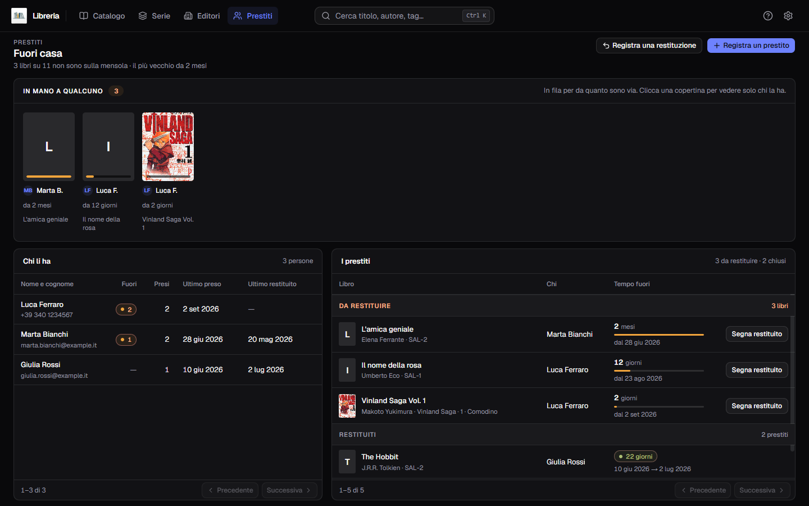
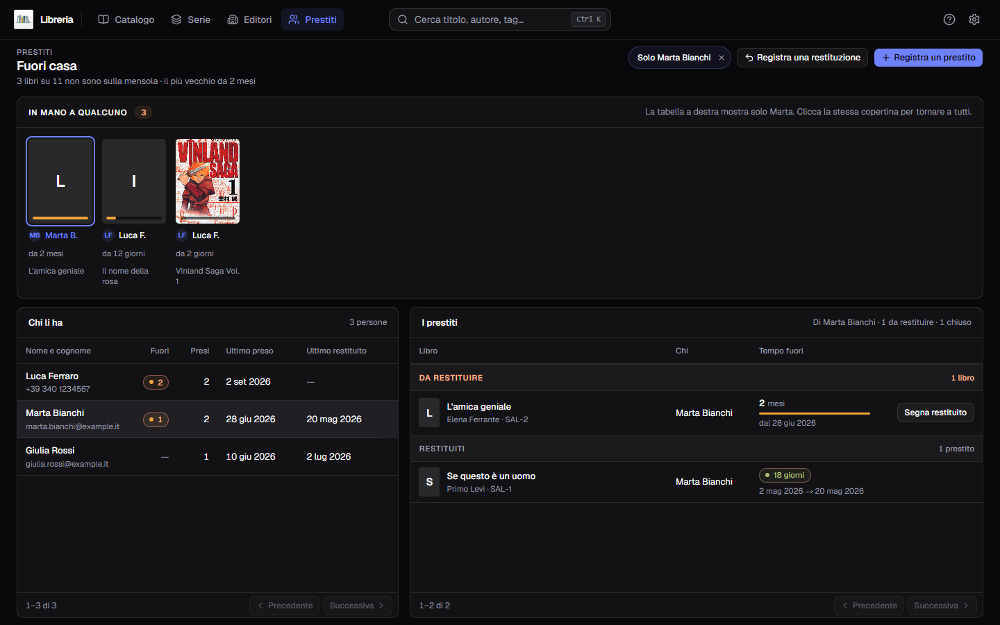
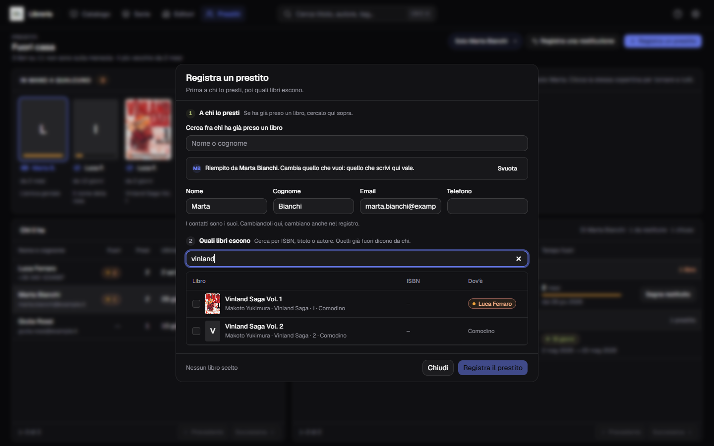
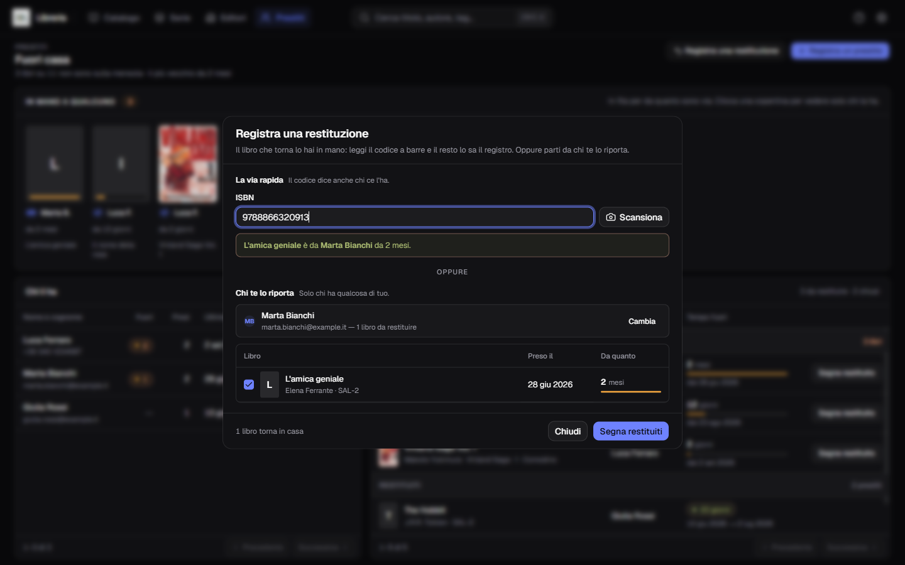
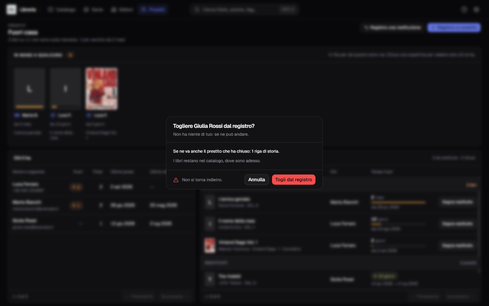

**Italiano** · [English](../en/Loans.md)

# I prestiti

La voce **Prestiti** nella barra risponde a una domanda sola: **dov'è finito
quel libro?**

È l'unica pagina che parla di quello che *non* c'è sullo scaffale. In cima dice
quanti libri sono via e da quanto — *«3 libri su 11 non sono sulla mensola · il
più vecchio da 2 mesi»* — e sotto mostra chi li ha.

Un prestito nasce solo da qui, con **Registra un prestito**. Finché non ne
registri uno, la pagina è vuota e spiega come si comincia.

## In mano a qualcuno

Sotto il titolo c'è la striscia dei libri che sono fuori: una copertina per
volume, **in fila per da quanto sono via** — il più vecchio per primo. Al piede
di ogni copertina un filo dice quanto tempo è passato, e sotto c'è il nome di chi
lo tiene.

**Clicca una copertina e la tabella dei prestiti si stringe su chi ha quel
libro.** Le altre copertine restano accese: un filtro attivo non è una ragione
per rendere illeggibile l'inventario. In alto a destra compare la pastiglia
`Solo Marta Bianchi`, e la sua `×` — o un secondo clic sulla stessa copertina —
torna a mostrare tutti.

La striscia non pagina, e non ne ha bisogno: **un esemplare può uscire una volta
sola**, quindi i libri fuori non possono mai essere più di quelli che hai in
catalogo.

## Chi li ha

A sinistra l'elenco delle persone. Una riga porta il nome e cognome, sotto il
contatto, e poi quattro numeri:

| Colonna | Cosa dice |
|---|---|
| **Fuori** | quanti tuoi libri ha adesso |
| **Presi** | quanti ne ha presi in tutto, da sempre |
| **Ultimo preso** | la data dell'ultimo prestito |
| **Ultimo restituito** | l'ultima volta che ti ha riportato qualcosa |

**Chi ha restituito tutto resta nell'elenco.** Non è un residuo: è la sola
informazione che conta il giorno che gli presti il libro dopo — quanti ne ha
presi, com'è andata, come si chiama davvero.

Cliccare una riga fa la stessa cosa di una copertina della striscia: stringe la
tabella a destra su quella persona.

## I prestiti

A destra **una tabella sola**, con quattro colonne: il libro, chi lo ha, il tempo
fuori e l'ultima cella. Prima i prestiti **da restituire**, poi quelli
**chiusi**, separati da un divisore che dice quanti sono e resta appiccicato
sotto l'intestazione mentre scorri.

Le colonne sono le stesse per tutti e due i gruppi: a cambiare sono le ultime due
celle.

- un prestito **aperto** porta il tempo con il suo filo e il pulsante **Segna
  restituito**, che lo chiude in un clic;
- un prestito **chiuso** porta la pastiglia e l'intervallo fra le due date —
  `4 set 2026 → 12 set 2026`.

In fondo c'è **un piede solo per le due liste**, cinquanta righe per volta, con
lo stesso conteggio del catalogo: `1–50 di 62`. Il divisore di un gruppo compare
dove la pagina ha davvero le sue righe, quindi a pagina 2 può capitare di vedere
solo *Restituiti*; i conti in testa e sui divisori restano invece quelli di
**tutti**, non quelli della pagina — dicono quanti sono, non quanti se ne vedono.

## Registrare un prestito

**Registra un prestito**, in alto a destra. Il dialogo ha due passi, e comincia
sempre dalla persona.

### Chi

La casella in cima **cerca fra chi ha già preso un libro**, e propone in un
elenco a comparsa. Accettando una proposta i quattro campi sotto — nome, cognome,
email, telefono — si riempiono da soli, e la riga *«Riempito da Luca Ferraro»*
dice da dove vengono. Quello che scrivi tu vale comunque di più: cambia quello
che vuoi, oppure premi **Svuota** e riparti a mano.

I contatti che modifichi qui **cambiano anche nel registro**: è il posto giusto
per correggere un numero di telefono vecchio.

Se cerchi un nome e ce ne sono due uguali, **non si riempie niente** e li vedi
tutti e due: riempire il cognome del Marco sbagliato è peggio che non riempirlo.

Chi non è ancora nel registro ci entra col primo prestito: basta scrivere il
nome. Di contatto ne serve uno solo — email **o** telefono.

### Quali libri

Il secondo passo resta spento finché non c'è un nome. Poi si cerca fra i libri
del catalogo **per ISBN, titolo o autore**, e se ne scelgono quanti si vuole: un
prestito può portarsi via tre volumi in un colpo.

I libri **già fuori compaiono spenti**, col nome di chi li ha: non si prestano
due volte.

## Registrare una restituzione

**Registra una restituzione** ha due vie, e non crea nessuno — chi restituisce ha
per forza già un tuo libro.

### Il codice a barre

La via rapida: lo stesso pannello dello [scanner del
modulo](Scansionare-il-codice-a-barre.md), inquadri il codice e il registro sa il
resto. Gli esiti sono **tre**, e il terzo non è un errore:

| Cosa dice | Che cosa vuol dire |
|---|---|
| *«Berserk Vol.1 è da Luca Ferraro da 2 mesi»* | il libro è fuori, e il prestito è già spuntato |
| *«… è in casa, in SAL-1: non c'è niente da restituire»* | il libro c'è, sullo scaffale |
| *«Nessun libro con il codice …»* | quel codice non è di nessun libro del catalogo |

Il terzo capita più spesso di quanto sembri, ed è quasi sempre colpa del libro,
non tuo: **su un volume ci sono due o tre codici stampati** — il prezzo, il
codice interno del negozio — e lo scanner legge quello che vede.

Il codice trova il libro e spunta il suo prestito, ma **non conferma niente da
sé**: la conferma resta un gesto tuo, perché un lettore che salva per conto
proprio chiuderebbe un prestito su una lettura sbagliata.

### La persona

L'altra via: scrivi chi te lo riporta, e vedi **solo i suoi libri fuori**. Spunti
quelli che sono tornati e confermi. Chi non ha niente di tuo non compare.

## Togliere una persona dal registro

L'ultima colonna dell'elenco, che compare passando il puntatore sulla riga.

**Si può solo a mani vuote.** Finché ha qualcosa fuori il pulsante è spento e
dice quanto: *«Marco Bianchi ha ancora 2 tuoi libri: prima te li fai
restituire»*. Non è una cortesia dell'interfaccia — è il programma che rifiuta,
perché il prestito aperto è la sola cosa che tiene quel libro fuori dalla
mensola, e portarlo via lo renderebbe di nuovo prestabile mentre è a casa di
qualcuno.

La conferma dice per intero cosa succede:

- **se ne va la sua storia** — i prestiti che ha chiuso, contati riga per riga;
- **i libri restano nel catalogo**, dove sono adesso: erano già tornati.

Non si annulla.

## Un libro prestato si vede anche dal catalogo

Non serve venire qui per sapere che un libro è fuori. Nel
[catalogo](Il-catalogo.md) lo dice la cella **Letto**: accanto allo stato di
lettura compare un segno, e fermandoci sopra il puntatore si legge tutto — *«Luca
Ferraro · prestato il 4 set 2026 (oggi)»*.

Nel [pannello dei filtri](Cercare-e-filtrare.md) c'è la faccetta **Prestito**,
con `fuori casa` e `in casa`: è il modo di vedere in una schermata sola tutto
quello che ti manca.

**Un libro fuori casa non si elimina**, e nemmeno la serie che lo contiene se lo
porta via: il cestino rifiuta e nomina chi ce l'ha. Prima te lo fai restituire.

## Due cose che il registro non fa

**Non c'è una scadenza.** In una libreria di casa non si multa nessuno: non
esiste un «restituire entro», non c'è niente in rosso e niente che scada. Quello
che il registro ti dice è che quel volume è fuori da otto mesi, e cosa farne lo
decidi tu.

**Un prestito sta su un libro, non su un titolo.** Se hai due copie dello stesso
volume, una può essere fuori e l'altra sulla mensola: il registro sa quale delle
due hai dato via.
