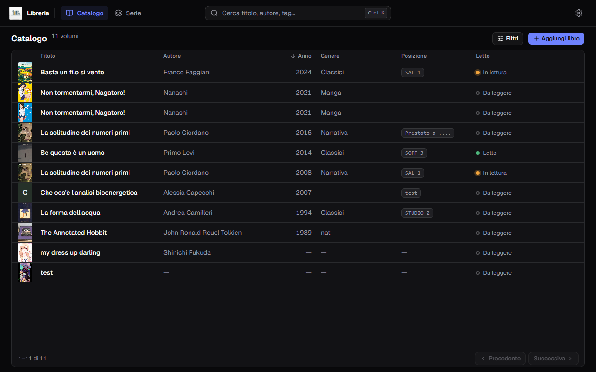
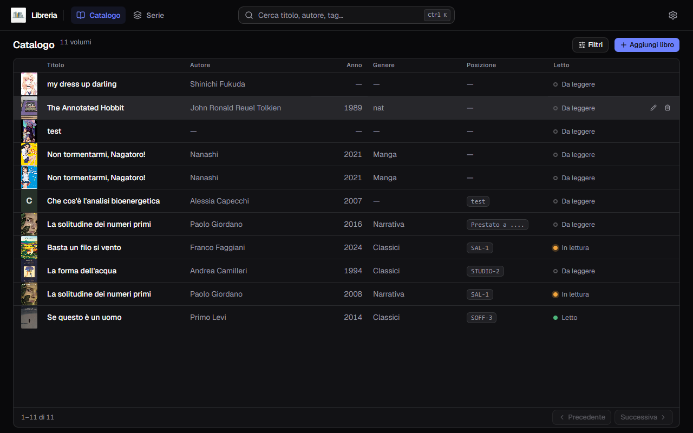
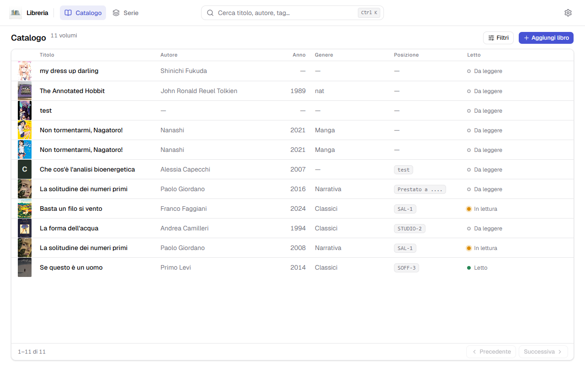

**Italiano** · [English](../en/The-catalogue.md)

# Il catalogo

È la schermata che si apre all'avvio: una riga per volume, sette colonne.

In alto a sinistra il conteggio dice quanti libri stai guardando — `11 volumi`
quando non c'è niente di attivo, `3 risultati` quando una ricerca o un filtro
hanno ristretto il campo.

## Le colonne

| Colonna | Cosa mostra |
|---|---|
| Copertina | la miniatura, oppure un dorso disegnato col colore dell'editore |
| Titolo | in grassetto |
| Autore | tutti gli autori del libro, separati da virgola |
| Anno | l'anno di **questa** edizione, non della prima |
| Genere | uno solo, quello che hai scritto nel modulo |
| Posizione | dove sta fisicamente: `SAL-1`, `STUDIO-2`, `Prestato a…` |
| Letto | `Da leggere`, `In lettura`, `Letto`, con un pallino colorato |

Un trattino `—` vuol dire che quel campo è vuoto: non è un errore, è un campo
che non hai riempito.

## Ordinare

Clic sull'intestazione di una colonna per ordinare. **Sei colonne su sette sono
ordinabili** — tutte tranne la copertina.

Ogni intestazione gira su **tre stati**: primo clic crescente, secondo
decrescente, terzo torna all'ordine di partenza.

## Modificare ed eliminare

Passa il puntatore su una riga: a destra compaiono due icone.

- **la matita** riapre il libro nel modulo, con tutti i campi già pieni;
- **il cestino** lo elimina, dopo una conferma. La copertina se ne va con lui.

L'eliminazione **non si annulla**. Se sbagli, la strada indietro è
[ripristinare un backup](Backup-e-ripristino.md) — che però riporta indietro
*tutto* il catalogo, non solo quel libro.

## Sfogliare

Quando i libri sono più di una pagina, in fondo alla finestra compaiono
**Precedente** e **Successiva**, con il conteggio a sinistra (`1–11 di 11`).

Il piede resta **incollato al fondo della finestra**, che tu abbia dieci libri o
duecento: a scorrere è solo la tabella, e l'intestazione delle colonne resta
visibile mentre scorri.

## Il tema chiaro

Tutto quello che vedi qui esiste anche in chiaro — si cambia dalle
[Impostazioni](Impostazioni.md).

