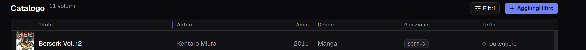

**Italiano** · [English](../en/The-catalogue.md)

# Il catalogo

È la schermata che si apre all'avvio: una riga per volume, sette colonne.

In alto a sinistra il conteggio dice quanti libri stai guardando — `11 volumi`
quando non c'è niente di attivo, `3 risultati` quando una ricerca o un filtro
hanno ristretto il campo.

## Le colonne

| Colonna | Cosa mostra |
|---|---|
| Copertina | la miniatura, oppure un dorso disegnato col colore dell'editore |
| Titolo | in grassetto, e sotto il **sottotitolo** in piccolo, dove c'è |
| Autore | tutti gli autori del libro, separati da virgola |
| Anno | l'anno di **questa** edizione, non della prima |
| Genere | uno solo, quello che hai scritto nel modulo |
| Posizione | dove sta fisicamente: `SAL-1`, `STUDIO-2`, `Comodino` |
| Letto | `Da leggere`, `In lettura`, `Letto`, con un pallino colorato |

**Un libro che è fuori casa lo dice la cella «Letto».** Accanto allo stato di
lettura compare un segno, e fermandoci sopra il puntatore si legge tutto quello
che c'è da sapere: *«Luca Ferraro · prestato il 4 set 2026 (oggi)»*. Non è una
nona colonna perché non ci sta — le larghezze sono tarate al pixel — ed è il
segno che ti spiega perché quel volume non è sullo scaffale dove dovrebbe. Tutto
il resto sta in [I prestiti](I-prestiti.md).

Un trattino `—` vuol dire che quel campo è vuoto: non è un errore, è un campo
che non hai riempito. I libri senza sottotitolo non lasciano una riga vuota: la
riga resta alta uguale per tutti, e il titolo si centra da solo.

**Se una colonna taglia qualcosa, fermaci sopra il puntatore.** Dopo un attimo
compare il valore intero — il titolo con il suo sottotitolo, l'autore, l'anno,
il genere, la posizione — senza bisogno di allargare la colonna. Sulla
copertina compare il titolo del libro, che lì non è scritto da nessuna parte.
Fa eccezione **Letto**, che la sua parola ce l'ha già a schermo.

## Ridimensionare le colonne

Il bordo destro di **Titolo**, **Autore** e **Genere** si trascina: passandoci
sopra il puntatore diventa una doppia freccia e compare un filo verticale.

Quello che una colonna prende lo perdono quelle alla sua destra, quindi la
tabella **riempie sempre la scheda** e non c'è mai niente da scorrere di lato.
Nessuna colonna scende sotto una larghezza minima: arrivate lì, le altre smettono
di cedere e la maniglia non va oltre.

Si fa anche **da tastiera**: `Tab` dopo l'intestazione porta il fuoco sulla
maniglia, e `←` e `→` la muovono un passo per volta.

**Anno e Letto restano strette e non si toccano.** Prendono il minimo che serve
alla loro intestazione e alla parola più lunga (`Da leggere`), e non hanno una
maniglia: sono due campi corti, e lo spazio che risparmiano va ai titoli, che
corti non sono. Lo stesso vale per la copertina e per le due icone in fondo.

La larghezza che scegli **resta al riavvio**. Non finisce nei backup: è una
preferenza di questa finestra, non un dato del catalogo.

## Ordinare

Clic sull'intestazione di una colonna per ordinare. **Sei colonne su sette sono
ordinabili** — tutte tranne la copertina.

Ogni intestazione gira su **tre stati**: primo clic crescente, secondo
decrescente, terzo torna all'ordine di partenza.

**Per titolo l'ordine segue i numeri, non le cifre.** `Vol. 2` viene prima di
`Vol. 10`, e non finisce fra `Vol. 1` e `Vol. 19` come farebbe un ordine
alfabetico. Fa una cosa sola, ma è quella che conta se cataloghi una serie: la
fila dei volumi si legge nell'ordine in cui li leggi tu. Gli zeri davanti non
cambiano niente — `Vol. 007` sta comunque prima di `Vol. 8`.

Sulle altre colonne l'ordine è alfabetico e maiuscole e minuscole non contano,
mentre le lettere accentate vanno in fondo.

## Modificare ed eliminare

Passa il puntatore su una riga: a destra compaiono due icone.

- **la matita** riapre il libro nel modulo, con tutti i campi già pieni;
- **il cestino** lo elimina, dopo una conferma. La copertina se ne va con lui.

L'eliminazione **non si annulla**. Se sbagli, la strada indietro è
[ripristinare un backup](Backup-e-ripristino.md) — che però riporta indietro
*tutto* il catalogo, non solo quel libro.

**Un libro che è in prestito non si elimina.** Il cestino rifiuta e nomina chi ce
l'ha: prima te lo fai restituire, poi lo togli. Vale anche per la spunta di
[Le serie](Le-serie.md) che porta via i volumi.

## Sfogliare

Quando i libri sono più di una pagina, in fondo alla finestra compaiono
**Precedente** e **Successiva**, con il conteggio a sinistra (`1–11 di 11`).

Il piede resta **incollato al fondo della finestra**, che tu abbia dieci libri o
duecento: a scorrere è solo la tabella, e l'intestazione delle colonne resta
visibile mentre scorri.

## Il tema chiaro

Tutto quello che vedi qui esiste anche in chiaro — si cambia dalle
[Impostazioni](Impostazioni.md).

