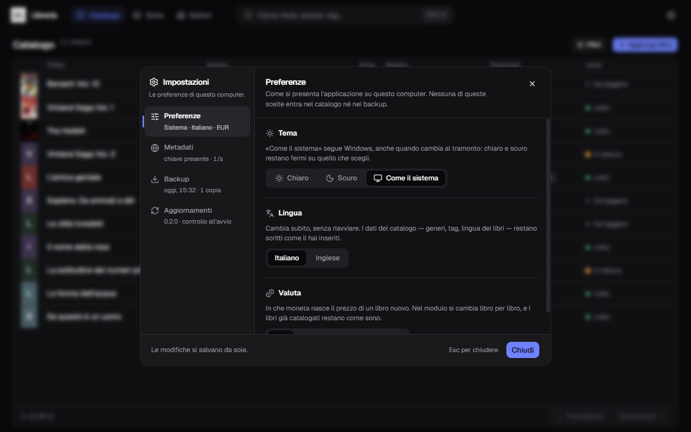
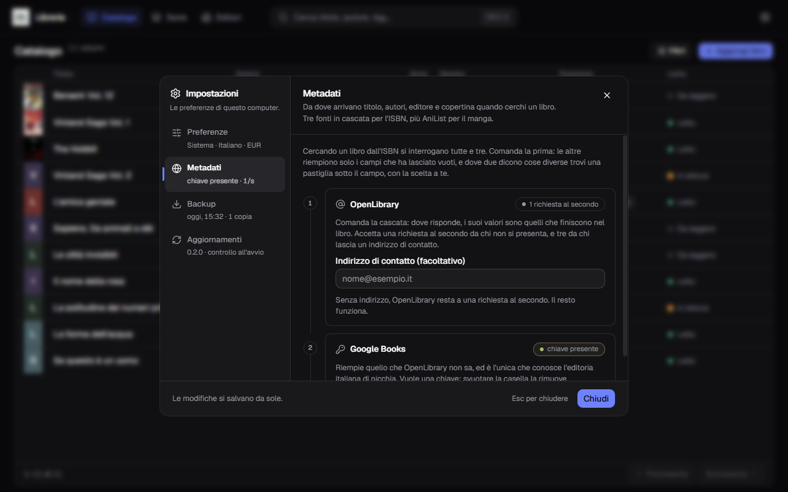
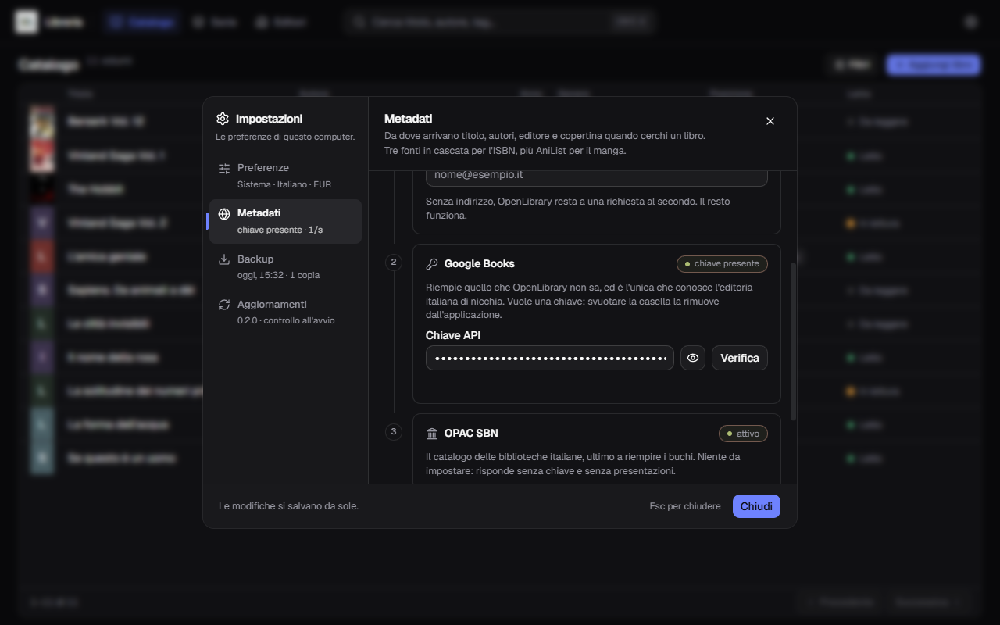
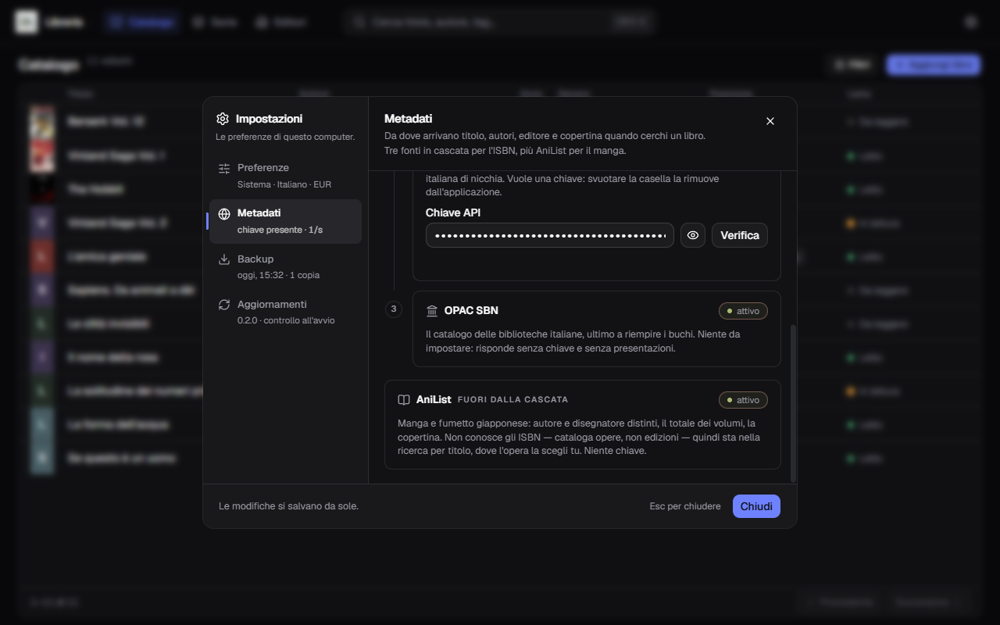
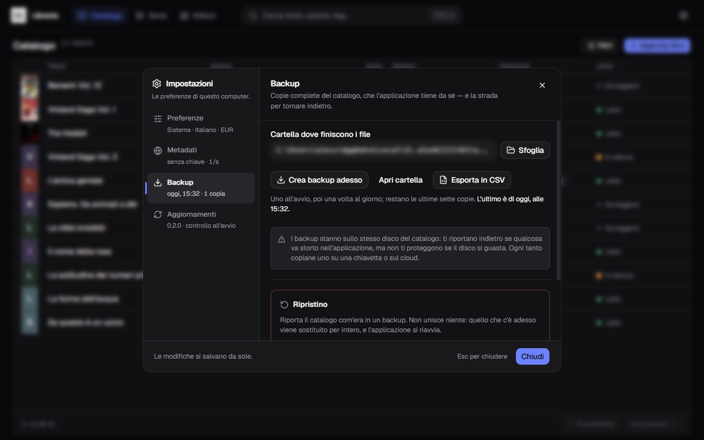
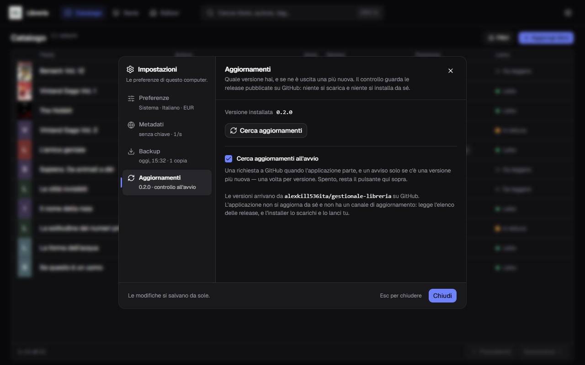

**Italiano** · [English](../en/Settings.md)

# Impostazioni

L'ingranaggio in alto a destra. Quattro sezioni su un binario a sinistra.

**Le modifiche si salvano da sole**, senza un pulsante Salva. La conferma non è
una parola: è la riga sotto ogni voce del binario, che riassume lo stato di
adesso — `Scuro · Italiano · EUR`, `chiave presente · 1/s`, `oggi, 12:41 · 4
copie`, `0.1.0 · controllo all'avvio` — e si riscrive appena cambi qualcosa,
anche da un'altra sezione.

## Preferenze

**Tema** — Chiaro, Scuro, oppure **Come il sistema**, che segue Windows anche
quando cambia al tramonto. Chiaro e scuro invece restano fermi.

**Lingua** — italiano o inglese. Cambia subito, senza riavviare, e vale anche
per i messaggi di errore. **Non** cambiano i dati che hai scritto tu: generi,
tag, posizioni e la lingua dei libri restano come li hai inseriti.

**Valuta** — EUR, USD, GBP, CHF, JPY. È la moneta con cui **nasce** un libro
nuovo: nel modulo si cambia libro per libro, e i libri già catalogati restano
come sono.

Nessuna di queste scelte entra nel catalogo né nei backup: stanno in un file a
parte, su questo computer.

## Metadati

Le fonti nell'ordine della cascata, numerate.

### 1 · OpenLibrary

Comanda la cascata: dove risponde, i suoi valori sono quelli che finiscono nel
libro.

C'è una casella sola, **Indirizzo di contatto**, ed è facoltativa. OpenLibrary
accetta **una richiesta al secondo** da chi non si presenta e **tre** da chi
lascia un indirizzo. Senza, funziona tutto lo stesso, solo più piano.

### 2 · Google Books

Riempie quello che OpenLibrary non sa, ed è **l'unica che conosce l'editoria
italiana di nicchia**. Vuole una chiave API, che si prende gratis dalla Google
Cloud Console.

- la chiave si scrive nella casella e resta **mascherata**; l'occhio la mostra;
- **Verifica** prova a usarla e dice subito se funziona;
- **svuotare la casella rimuove la chiave** dall'applicazione. Senza chiave,
  Google Books viene semplicemente saltato.

Le quote gratuite sono 1.000 richieste al giorno e 100 al minuto, e la ricerca
di un libro ne spende **una**: catalogando a mano non le si raggiunge.

### 3 · OPAC SBN

Il catalogo delle biblioteche italiane. **Niente da impostare**: risponde senza
chiave e senza presentazioni.

### 4 · NiceBooks

Ultima a riempire i buchi, ed è quella che tiene su **l'editoria italiana che le
altre non conoscono** — manga compresi. **Niente da impostare**: nessuna chiave,
nessuna registrazione, un ritmo di una richiesta al secondo fissato nel
programma.

Per ogni libro fa **due richieste** invece di una, quindi è anche la ragione per
cui una ricerca per ISBN ci mette un paio di secondi in più. È il prezzo della
copertura: sta in fondo, quindi lavora solo dove le altre tre non hanno saputo
rispondere.

### AniList — fuori dalla cascata

Manga e fumetto giapponese. Non conosce gli ISBN, quindi non entra nella cascata
e compare solo nella ricerca per titolo. Nessuna chiave, nessuna impostazione.

## Backup

Tutto quello che c'è qui è raccontato per esteso in
[Backup e ripristino](Backup-e-ripristino.md). In breve:

- **la cartella** dove finiscono i file, cambiabile con Sfoglia;
- **Crea backup adesso**, **Apri cartella**, **Esporta in CSV**;
- il blocco **Ripristino**, cerchiato di rosso perché sostituisce tutto.

## Aggiornamenti

La versione installata, un pulsante per **cercare subito** una versione nuova, e
la spunta **Cerca aggiornamenti all'avvio**, che si può togliere.

Se c'è qualcosa di nuovo trovi il numero, la data e le novità, con il pulsante
che porta alla pagina da cui scaricare. **Niente si scarica e niente si installa
da sé**: il perché, e cosa fanno i tre pulsanti dell'avviso, stanno in
[Aggiornamenti](Aggiornamenti.md).

## Dove stanno queste impostazioni

In `impostazioni.json`, nella cartella dei dati, **fuori dal database e fuori
dai backup**.

Non è un dettaglio: un archivio ripristinato non ti porta il tema, la chiave API
e la fotocamera di un altro computer. Sono preferenze di *questa* macchina, e
restano dove sono anche dopo un ripristino.
