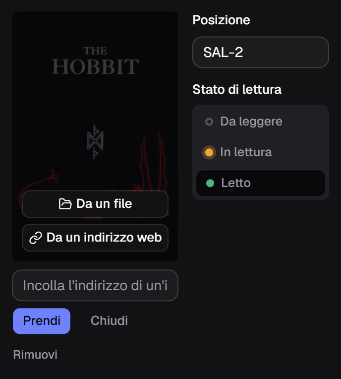
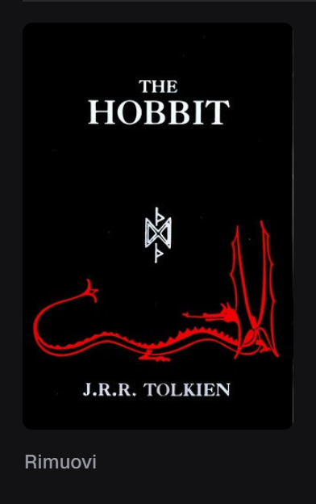

**Italiano** · [English](../en/Covers.md)

# Le copertine

Il riquadro tratteggiato a sinistra nel modulo. Ci si arriva per tre strade.

## 1. Da sola, cercando i metadati

Quando il riquadro è vuoto e [la ricerca dei metadati](Cercare-i-metadati.md) trova
un'immagine, questa scende senza che tu prema niente. Succede con **OpenLibrary**,
con **NiceBooks** e con **AniList** — e la riga sotto l'ISBN dice sempre di chi è
l'immagine arrivata.

Se una copertina c'è già, non viene sostituita: te lo dice una riga sotto l'ISBN
— *«OpenLibrary ha una copertina, ma il riquadro ne ha già una»* — e se la vuoi
davvero basta togliere quella di adesso e ricercare.

Le immagini di **Google Books non si scaricano**, anche quando Google le ha: i
termini d'uso della loro API non permettono di riospitarle. Non è un limite
tecnico ed è inutile riprovare.

## 2. Da un file sul disco

**Da un file** apre la finestra di Windows. Prendi un JPEG o un PNG e lo copia
nella cartella delle copertine: da quel momento è al sicuro anche se sposti o
cancelli l'originale.

## 3. Da un indirizzo web

**Da un indirizzo web** apre una casella dove incollare l'URL di un'immagine, e
**Prendi** la scarica.

Il file arriva sempre nella cartella dei dati: **il catalogo non tiene link a
immagini altrui**, quindi la copertina resta anche quando quel sito chiude.

## Chi non ha copertina

Non resta un buco: l'applicazione disegna un dorso con **l'iniziale del titolo**,
su uno di otto colori scelto **in base all'editore**. Due libri dello stesso
editore hanno lo stesso colore, il che rende riconoscibile una collana a colpo
d'occhio; un libro senza editore prende un grigio neutro.

Nella riga di una serie i dorsi disegnati marcano i volumi che ti mancano — vedi
[Le serie](Le-serie.md).

## Togliere una copertina

Sotto l'immagine c'è **Rimuovi**. Il file sparisce dal disco al salvataggio.

## Dove stanno

In `%LOCALAPPDATA%\it.alexkill536ita.gestionale-libreria\covers\`, un JPEG per
libro con un nome casuale. **Entrano nei backup**, quindi un archivio ripristinato
se le riporta dietro.

Le immagini vengono ricodificate in JPEG alla risoluzione originale: non vengono
rimpicciolite, ma un PNG da 12 MB non resta da 12 MB.
