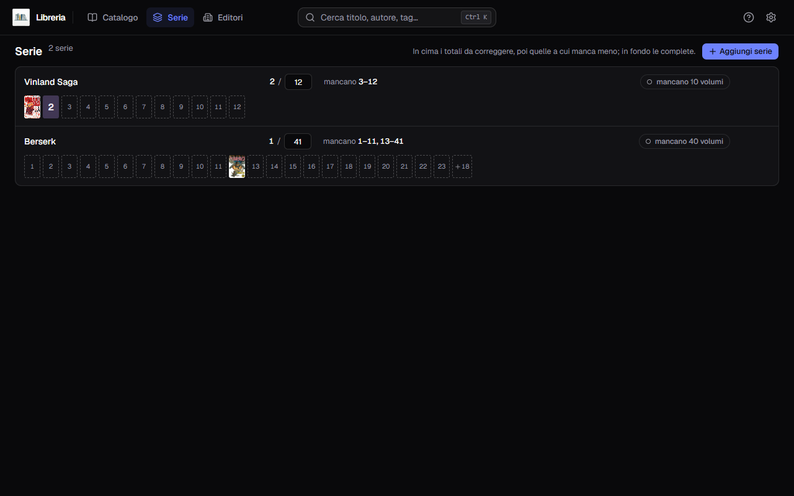
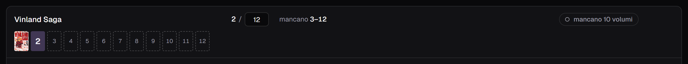
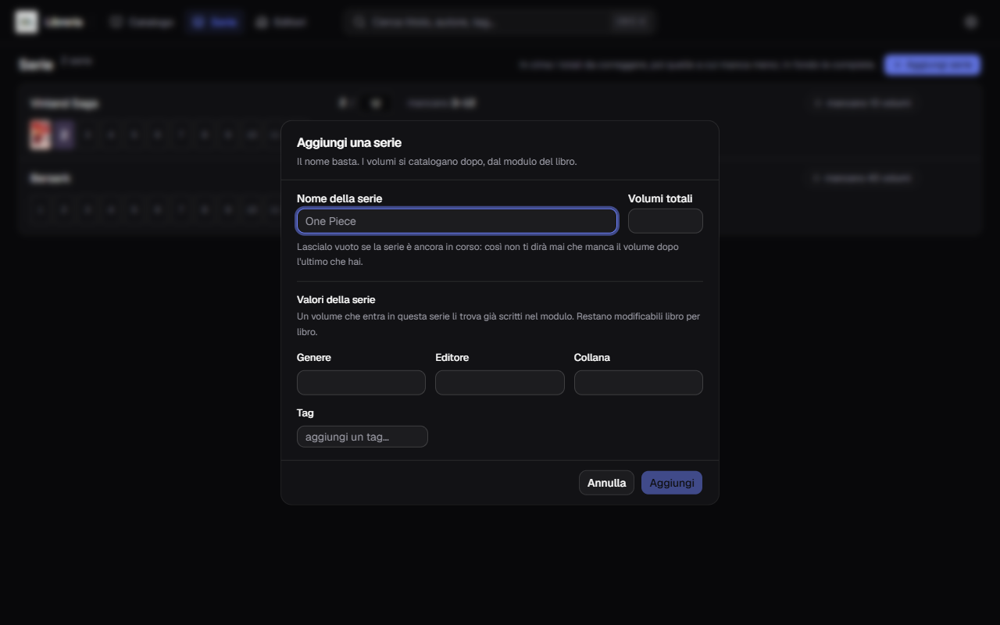
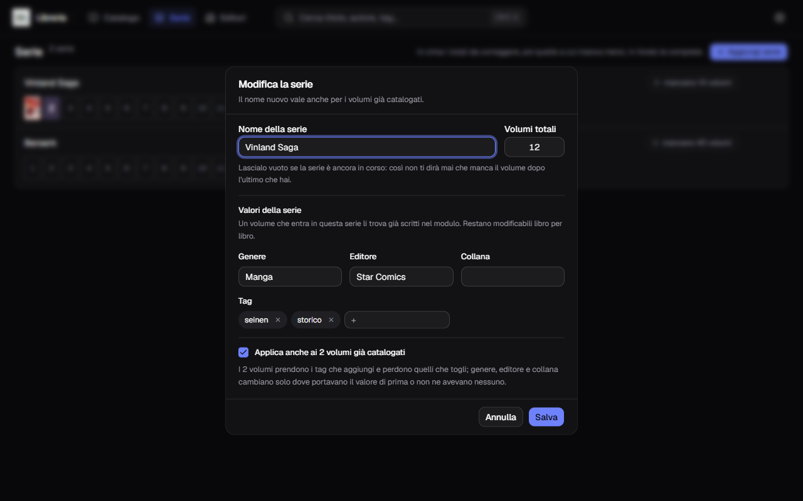
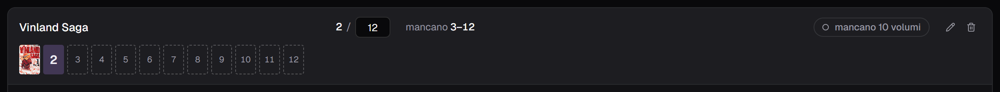
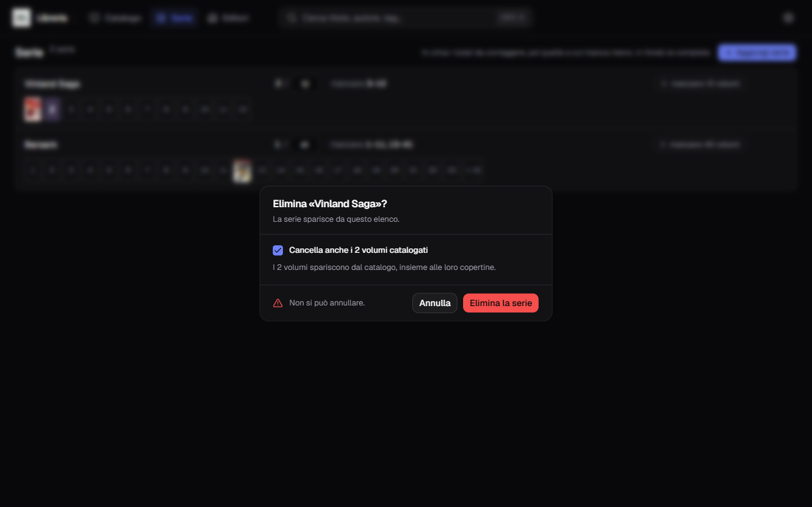

**Italiano** · [English](../en/Series.md)

# Le serie

La voce **Serie** nella barra risponde a una domanda sola: **quali volumi mi
mancano?**

Una serie compare qui appena scrivi il suo nome nel modulo di un libro. Non c'è
niente da preparare prima.

## Come si legge una riga

Da sinistra:

- **il nome** della serie;
- **quanti ne hai su quanti** — `2 / 12`. Il totale sta in una casella
  modificabile: correggilo lì e basta, si salva da solo;
- **quali mancano**, con i buchi accorpati: `mancano 3–12` invece di
  dieci numeri in fila;
- a destra, la pastiglia con il conto: `mancano 10 volumi`;
- sotto, **la fila dei dorsi**: copertina vera per i volumi che hai, riquadro
  tratteggiato col numero per quelli che mancano.

Fermando il puntatore su una casella si legge **di che volume si tratta** —
`vol. 9 · My dress up darling. Bisque doll Vol.9`, col sottotitolo dove c'è —
e su un riquadro tratteggiato, quale volume manca. Serve soprattutto sulle serie
lunghe, dove venti copertine piccole si somigliano tutte.

L'ordine dell'elenco non è alfabetico: **in cima i totali da correggere** — le
serie dove hai più volumi di quanti il totale dichiari, che è il segno di un
totale sbagliato — poi quelle a cui manca meno, e in fondo le complete.

## Aggiungere una serie

**Aggiungi serie**, in alto a destra.

Il nome basta. Il totale si può lasciare vuoto, e conviene farlo quando la serie
è ancora in corso: senza totale, l'applicazione non ti dirà mai che manca il
volume dopo l'ultimo che hai.

Sotto ci sono già i quattro valori della sezione qui sotto — tag, genere, editore
e collana — e si possono riempire subito o lasciare che li impari da sé.

I volumi si catalogano dopo, dal modulo del libro, scrivendo quel nome nel campo
Serie.

## I valori della serie

Oltre al nome e al totale, una serie porta con sé quattro cose: **tag, genere,
editore e collana**. Non c'è da dichiararle: **la serie le impara dai volumi che
le assegni.**

- i **tag** si sommano — quelli di ogni volume entrano nella serie, e da soli non
  ne escono più;
- **genere, editore e collana** li detta il **primo volume che ne porta uno**, e
  nessun volume salvato dopo li sposta. Senza questa regola la serie inseguirebbe
  l'ultimo libro toccato, e l'editore ballerebbe a ogni salvataggio.

Da lì tornano indietro. **Un libro che entra in quella serie se li trova già
scritti nel modulo**, e con prudenza:

- i **tag** si aggiungono a quelli che hai già messo;
- **genere, editore e collana** si riempiono **solo dove erano vuoti** — quello
  che hai scritto tu non si tocca;
- un tag che hai tolto **non ritorna** finché resti in quella serie.

Se la serie ha riempito qualcosa sotto **Altri dettagli**, quel pannello si apre
da sé: così lo vedi invece di scoprirlo dopo aver salvato.

## Correggere i valori a mano

La matita apre il dialogo, dove i quattro valori stanno sotto il nome e il
totale. Sono caselle come quelle del modulo, con gli stessi suggerimenti.

In modifica compare anche una spunta, **accesa**: *«Applica anche ai N volumi già
catalogati»*. È il modo di sistemare quaranta volumi in un colpo, e **non è una
sostituzione**:

| Cosa cambi nel dialogo | Cosa succede ai volumi |
|---|---|
| Aggiungi un tag | entra su tutti |
| Togli un tag | esce da tutti quelli che ce l'hanno |
| Cambi genere, editore o collana | si scrive **solo** dove il volume portava il valore di prima, o non ne aveva nessuno |
| **Svuoti** una casella | **niente**: vuol dire «la serie non lo detta più», non «cancellalo dai libri» |

Le ultime due righe sono la ragione per cui questa non è una sostituzione secca:
il volume ristampato da un altro editore non viene appiattito sugli altri, e una
casella svuotata per distrazione non porta via un dato da quaranta libri.

**Sui tag tolti, invece, guarda due volte prima di salvare.** Siccome la serie ha
già imparato i tag di *tutti* i suoi volumi, quello che togli dalla casella se ne
va davvero da tutti i volumi che ce l'avevano — anche se ce l'avevi messo tu, su
un volume solo. È voluto, ma è la cosa che si nota dopo.

Togliendo la spunta i volumi già catalogati restano come sono, e i valori
varranno solo per quelli che aggiungerai dopo. Quando crei una serie nuova la
spunta non c'è: non ci sono ancora volumi da toccare.

## Modificare ed eliminare

Passa il puntatore su una riga: a destra compaiono la matita e il cestino.

La matita apre il dialogo qui sopra. Il cestino chiede conferma:

Attenzione alla spunta, che è **attiva di default**:

- **spuntata** — spariscono anche i volumi catalogati, con le loro copertine;
- **tolta** — i volumi restano nel catalogo e perdono soltanto serie e numero.

Non si annulla. Una serie senza volumi non mostra la spunta, perché non c'è
niente da portarsi dietro.

## Il totale dei volumi: due strade

Lo stesso numero si tocca in due posti, e non fanno la stessa cosa:

| Dove | Cosa succede svuotando la casella |
|---|---|
| **Qui, in `/serie`** | il totale sparisce davvero |
| Nel modulo di un libro | **non** succede niente: il totale resta |

La differenza è voluta. Quel numero appartiene alla serie, non alla singola
copia: se svuotare la casella nel modulo lo azzerasse, salvare *un* volume
cancellerebbe il totale per tutti gli altri. La casella nel modulo serve perché
è lì che il totale arriva da AniList senza che tu debba digitarlo.

## Una serie vuota non sparisce

Una serie aggiunta a mano resta nell'elenco anche senza volumi, e anche dopo un
riavvio. Se non la vuoi più, si toglie con il suo cestino.
