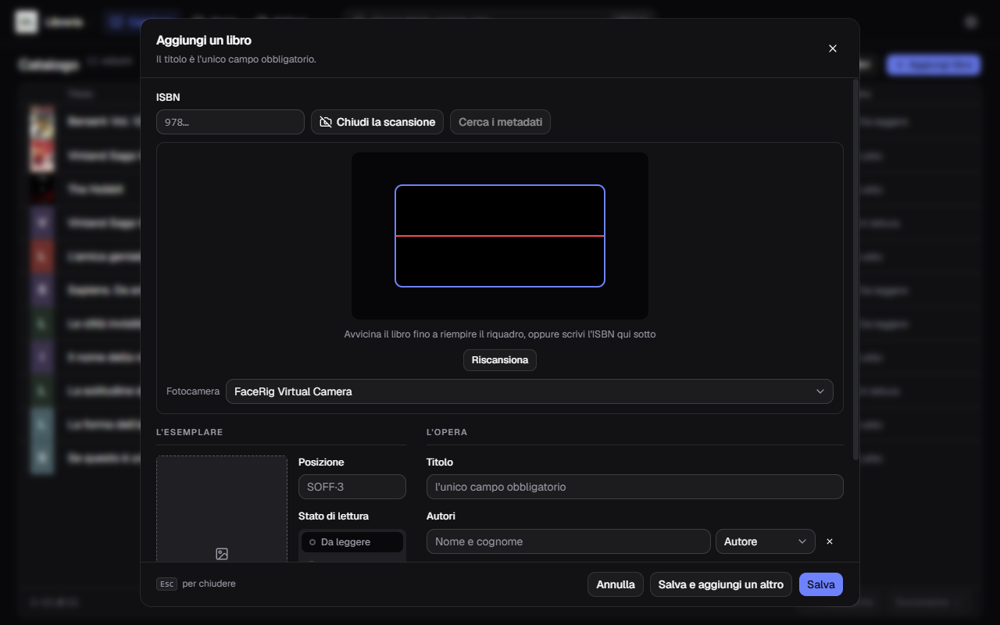
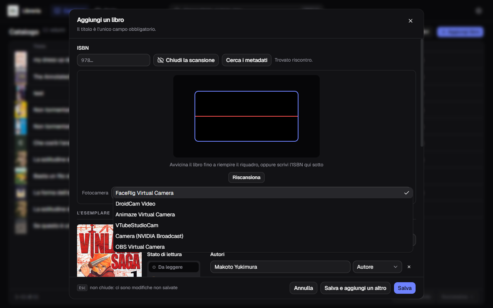

**Italiano** · [English](../en/Scanning-the-barcode.md)

# Scansionare il codice a barre

Il pulsante **Scansiona**, accanto al campo ISBN nel modulo, accende la webcam e
legge il codice a barre dalla quarta di copertina.

## Come si usa

1. **Scansiona** apre il mirino dentro il modulo.
2. Avvicina il libro fino a **riempire il riquadro azzurro** con il codice a
   barre: è la parte dell'immagine che viene guardata, e un codice piccolo al
   centro dell'inquadratura non basta.
3. Appena legge, l'ISBN si scrive da sé nel campo e **parte la ricerca dei
   metadati**. Non devi premere altro.
4. Completa quello che manca — posizione, prezzo, stato di lettura — e salva.

Con **Salva e aggiungi un altro** il modulo si svuota ma **la fotocamera resta
accesa**: è il modo di catalogare una pila di libri senza riaprire niente.

**Riscansiona** rimette in ascolto dopo una lettura, se hai inquadrato il libro
sbagliato. **Chiudi la scansione** spegne la webcam.

**Lo stesso mirino serve anche a farsi restituire un libro.** In
[Prestiti → Registra una restituzione](I-prestiti.md) è la via rapida: inquadri
il codice del volume che ti riportano e il registro dice da chi era, spuntando il
prestito giusto. È lo stesso pannello, con gli stessi tasti.

Se preferisci, puoi sempre scrivere l'ISBN a mano nel campo qui sotto: il mirino
non ti obbliga a nulla.

## Che codici legge

Quattro tipi, non uno: **EAN-13**, **UPC-A**, **Code 39** e **ITF**. Il primo è
quello che porta l'ISBN sui libri di oggi; gli altri servono alle edizioni
vecchie, che l'ISBN ce l'hanno stampato in chiaro ma non in un codice a barre
suo.

Lo scanner **legge e basta**: non decide se quello che ha letto sia un ISBN, lo
scrive nel campo e lascia dire al programma se sta in piedi. Il rovescio è che su
un libro con più codici — il prezzo, l'etichetta del negozio — può prendere
quello sbagliato: se il numero che compare non somiglia a un ISBN, **Riscansiona**
e inquadra l'altro.

## Il mirino è nero

È il caso più comune, e quasi sempre non è un guasto: Windows ha scelto da sé
una **fotocamera virtuale** — OBS, FaceRig, NVIDIA Broadcast, DroidCam — che non
sta trasmettendo niente. Nell'immagine qui sopra è proprio quello che è successo.

La cura è la tendina **Fotocamera** sotto il mirino.

Scegli quella vera — di solito ha il nome del modello, tipo `PC-LM1E Camera` — e
il mirino si accende. La scelta viene ricordata per la volta dopo.

Se l'elenco mostra una voce sola e senza nome, vuol dire che il permesso alla
fotocamera non è ancora stato dato: concedilo e riapri il pannello.

## Non legge il codice

Nell'ordine, le cause che si vedono davvero:

- **il codice non riempie il riquadro** — avvicina il libro, è quasi sempre
  questo;
- **luce riflessa** sulla plastica della copertina: inclina il libro, o
  allontanati dalla lampada;
- **codice rovinato o stampato male** — succede sugli usati. Scrivi le tredici
  cifre a mano: sono stampate in chiaro sotto le barre;
- **il libro non ha un ISBN.** I libri di prima degli anni Settanta non ce
  l'hanno, e non c'è niente da scansionare: cerca per titolo, come descritto in
  [Cercare i metadati](Cercare-i-metadati.md).

## L'ISBN che hai già catalogato

Se lo stesso codice viene letto due volte di seguito, il secondo viene ignorato
con una nota: è la webcam che vede lo stesso libro per trenta fotogrammi, non tu
che scansioni due volte.

Se invece l'ISBN esiste già nel catalogo, l'applicazione **te lo dice ma non ti
ferma**: due copie dello stesso libro sono due esemplari legittimi, e magari uno
è prestato.
